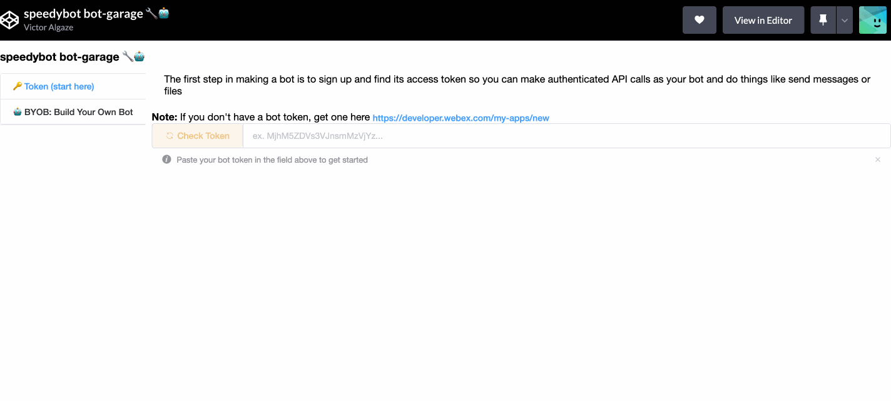

# 🏖 `speedybot hub` [λLambda-editionλ] super-fast "no-ops" conversation design infrastructure

```
╔═╗ ╔═╗ ╔═╗ ╔═╗ ╔╦╗ ╦ ╦ ╔╗  ╔═╗ ╔╦╗
╚═╗ ╠═╝ ║╣  ║╣   ║║ ╚╦╝ ╠╩╗ ║ ║  ║
╚═╝ ╩   ╚═╝ ╚═╝ ═╩╝  ╩  ╚═╝ ╚═╝  ╩ HUB (λ-Edition)

tl:dr; serverless chat infra
```

📚 [API Docs](./api-docs/modules.md)

**What is this:** 🧪Experimental🔬 branch that ports **[speedybot-hub](https://github.com/valgaze/speedybot-hub)** for use in an AWS Lambda function (rather than serverless+containerless Workers or V8 Isolates)

**[jump to setup](#setup)**
**[jump to issues](#issues)**

Once you have the infrastructure up, the only directory that you need to really think about is **[settings](./settings/)** which houses your agent's handlers & integrations.

## Video instructions

- 🎥 [EN] https://share.descript.com/view/mJ9mY8swWId

## Setup

**Note on "SST":** This branch uses **[Serverless Stack (SST)](https://serverless-stack.com/)** toolchain for provisioning, deployment of infrastructure. SST is built on top of a version **[AWS Cloud Development Kit (cdk)](https://aws.amazon.com/cdk/)** let's you express your infrastructure needs as spec/code. Its **[live-reload editing feature for Lambda functions](https://docs.sst.dev/live-lambda-development)** will likely be a game-changer for people building conversation experiences which reuire rapid testing + experimentation

likely come in handy for people building conversation experiences who need to rapidly make many content/integration changes.

## 1. Fetch repo & install dependencies

Note: We need to checkout the "lambda" branch below

```
git clone https://github.com/valgaze/speedybot-hub
cd speedybot-hub
git checkout lambda
npm run setup
```

## 2. Set your bot access token

- If you have an existing bot, get its token here: **[https://developer.webex.com/my-apps](https://developer.webex.com/my-apps)**

- If you don't have a bot, create one and save the token from here: **[https://developer.webex.com/my-apps/new/bot](https://developer.webex.com/my-apps/new/bot)**

- Copy the file **[.env.example](./.env.example)** as `.env` in the root of your project and save your access token under the `token` field

Note: The `.env` file will never be aded to source control, **[further details here](https://docs.sst.dev/environment-variables)**

## 3. Set up your AWS credentials on your machine

Note: You'll need an AWS account that has authorization/billing to create lambda functions

3a. Setup IAM here: https://sst.dev/chapters/create-an-iam-user.html

3b. Setup AWS CLI: https://sst.dev/chapters/configure-the-aws-cli.html

## 4. Boot your Bot & get its public url

Start local websocket mode by running

```sh
npm start
```

If deployment is successful, you should find that your url that looks something like this: https://abcd123456.execute-api.us-east-1.amazonaws.com

Note: This uses SST's **[Live Lambda Development feature](https://docs.sst.dev/live-lambda-development)**

## 4. Register webhooks using Speedybot Garage

In order to receive messages, you'll need to register your agent's URL to receive webhooks for chat.

Try using **[Speedybot bot-garage 🔧🤖](https://codepen.io/valgaze/full/MWVjEZV)**, (source available for inspection **[here](https://github.com/valgaze/speedybot-hub/blob/lambda/settings/speedybot_garage.html)**) and select "webhooks" after registering your token



## 4b. (Alternative) Register webhooks using the command line

In a terminal enter the following command:

- Replace t argument with your token
- Replce w argument with your lambda url

```sh
npm init -y speedybot webhook create -- -t _token_here_ -w https://abcd123456.execute-api.us-east-1.amazonaws.com
```

Tip: If you're having trouble, you can enter your token & URL step by step by entering `npm init -y speedybot webhook create`

## 5. Take it for a spin

To make sure all is well, add your bot from Step 1 in a 1-1 chat session and tell it "healthcheck"-- if everything is configured properly you should see something like this:


## 6. Deploy

Once your agent is just the way you want it, make sure

1. You have set a webhook "secret", instructions **[here](#webhook-secrets)**
2. You have securely exposed your **[access token as a secret](https://sst.dev/chapters/handling-secrets-in-sst.html)** in **[.env](./env.example)**
3. You have a strategy for staging deployments, **[details here](https://docs.sst.dev/architecture#stages)**

When all is ready, just hit CTRL-C to stop your local websocket service and deploy the real thing:

```
npm run deploy
```

## Issues

### Potential issues/bugs 🐞🪲

1. "cold-start" problem

- This is an issue that does not affect Workers/V8 Isolates (see the **[deploy branch](https://github.com/valgaze/speedybot-hub/blob/deploy/quickstart.md)** for an implementation using Workers/V8-Isolates)

- Various solutions available like provisioned concurrency, various tune-ups & tricks

2. ~"doubling" problem~

- Not consistent: Occassionally a command needs to be sent twice in order to provoke a response from the agent-- unclear why (would never occur when running locally w/ `npm start`)

## Webhook Secrets

<details><summary>Webhook Secrets</summary>

You can secure your webhooks using "secrets", below are how to use them

1. Come up with a secret and save it under `secret` in your project's root **[.env file](./.env.example)**

2. Create a new webhook in **[Speedybot bot-garage 🔧🤖](https://codepen.io/valgaze/full/MWVjEZV)** & include the secret

3. In **[settings/config.ts](./settings/config.ts)** add a validation function that looks something like this:

```
import crypto from 'crypto'
import { APIGatewayProxyEventV2, Context } from 'aws-lambda'

async function validate(body: any, event: APIGatewayProxyEventV2, ctx: Context) {
  const validateSignature = <T = any>(
    signature: string,
    secret: string,
    requestBody: T
  ): boolean => {
    const hmac = crypto.createHmac('sha1', secret)
    if (typeof requestBody === 'string') {
      hmac.update(requestBody)
    } else {
      hmac.update(JSON.stringify(requestBody))
    }
    const isValid = hmac.digest('hex') === signature
    return isValid
  }
  const signature = event.headers['x-spark-signature']
  const secret = process.env.secret // passed through via .env
  if (secret) {
    const proceed = validateSignature(
      signature as string,
      secret as string,
      body
    )
    return { proceed: proceed }
  }
}
```

4. Delete any non-secured webhooks if they exist and deploy your secured project with

```
npm run deploy
```

</details>
