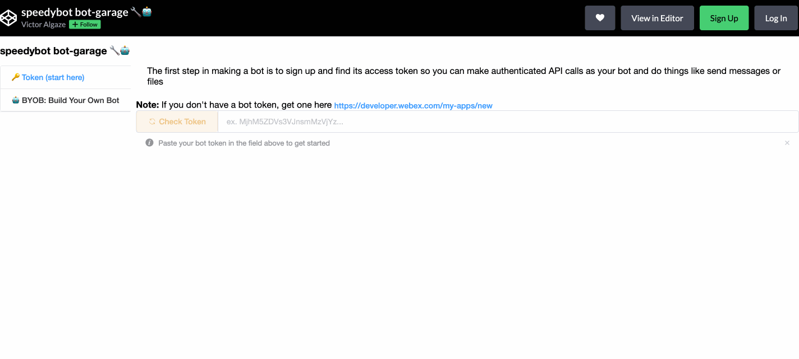

TODO 0) come up with propagand blitz, video paln
Show visual editor
Show lambda serverless bots with typescript

Oh yah btw here is SERVERLESS

Here are some API docs
Here is speedybot-lambda
speedybot (speedybot@webex.bot) runs on a Worker/V8 Isolate

All you need to worry about it settings/handlers.ts

1. sayhello, publish speedybot-web

# 🏖 `speedybot hub` [λLambda-editionλ] super-fast "no-ops" conversation design infrastructure

```
╔═╗ ╔═╗ ╔═╗ ╔═╗ ╔╦╗ ╦ ╦ ╔╗  ╔═╗ ╔╦╗
╚═╗ ╠═╝ ║╣  ║╣   ║║ ╚╦╝ ╠╩╗ ║ ║  ║
╚═╝ ╩   ╚═╝ ╚═╝ ═╩╝  ╩  ╚═╝ ╚═╝  ╩ HUB (λ-Edition)

tl:dr; serverless chat infra
```

📚 [API Docs](./api-docs/modules.md)

**What is this:** Experimental branch that ports **[speedybot-hub](https://github.com/valgaze/speedybot-hub)** for use in an AWS Lambda function (rather than serverless+containerless Workers or V8 Isolates)

**[jump to setup](#setup)**
**[jump to issues](#issues)**

The only directory that you need to really think about is **[settings](./settings/)** which houses your handlers & integrations

## Setup

This branch uses **[Serverless Stack (SST)](https://serverless-stack.com/)** toolchain for provisioning, deployment. SST is one of many tools one could use to deploy, but SST has a sepcial **[live-reload editing feature for Lambda functions](https://docs.sst.dev/live-lambda-development)** that will probably be useful for people building conversation experiences.

## 1. Fetch repo & install dependencies

Note: We need to checkout the "lambda" branch below

```
git clone https://github.com/valgaze/speedybot-hub
cd speedybot-hub
git checkout lambda
npm run setup
```

## 2. Set your bot access token

- If you have an existing bot, get its token here: **[https://developer.webex.com/my-apps](https://developer.webex.com/my-apps)**

- If you don't have a bot, create one and save the token from here: **[https://developer.webex.com/my-apps/new/bot](https://developer.webex.com/my-apps/new/bot)**

Once you have the bot's token, save it to **[settings/config.ts](./settings/config.ts)** under the `token` field

## 3. Set up your AWS credentials on your machine

Note: You'll need an AWS account that has authorization/billing to create lambda functions

3a. Setup IAM here: https://sst.dev/chapters/create-an-iam-user.html

3b. Setup AWS CLI: https://sst.dev/chapters/configure-the-aws-cli.html

## 4. Boot your Bot & get its public url

```sh
npm run deploy
```

If deployment is successful, you should your url that looks something like this: https://abcd123456.execute-api.us-east-1.amazonaws.com

## 4. Register webhooks using Speedybot Garage

In order to receive messages, you'll need to register your agent's URL to receive webhooks for chat.

Try using **[Speedybot bot-garage](https://codepen.io/valgaze/full/MWVjEZV)**, (source available for inspection **[here](https://github.com/valgaze/speedybot-hub/blob/deploy/settings/speedybot_garage.html)**) and select "webhooks" after registering your token



## 4b. (Alternative) Register webhooks using the command line

In a terminal enter the following command:

- Replace t argument with your token
- Replce w argument with your lambda url

```sh
npm init -y speedybot webhook create -- -t _token_here_ -w https://abcd123456.execute-api.us-east-1.amazonaws.com
```

Tip: If you're having trouble, you can enter your token & URL step by step by entering `npm init -y speedybot webhook create`

## 5. Take it for a spin

To make sure all is well, add your bot from Step 1 in a 1-1 chat session and tell it "healthcheck"-- if everything is configured properly you should see something like this:


## Issues

### Current issues/bugs 🐞🪲

1. "cold-start" problem

- This is an issue that does not affect Workers/V8 Isolates (see the **[deploy branch](https://github.com/valgaze/speedybot-hub/blob/deploy/quickstart.md)** for an implementation using Workers/V8-Isolates)

- Various solutions available like provisioned concurrency, various tune-ups & tricks

2. Occassional "doubling" problem

- Not consistent: Occassionally a command needs to be sent twice in order to provoke a response from the agent-- unclear why

**Interesting:** If you run the websocket version locally (ie `npm start`) this issue goes away. There is something strange in the network/Lambda/gateway/etc. This is the same toolchain/code powering speedybot-hub which works correctly/performantantly on V8 Isolates/Workers
