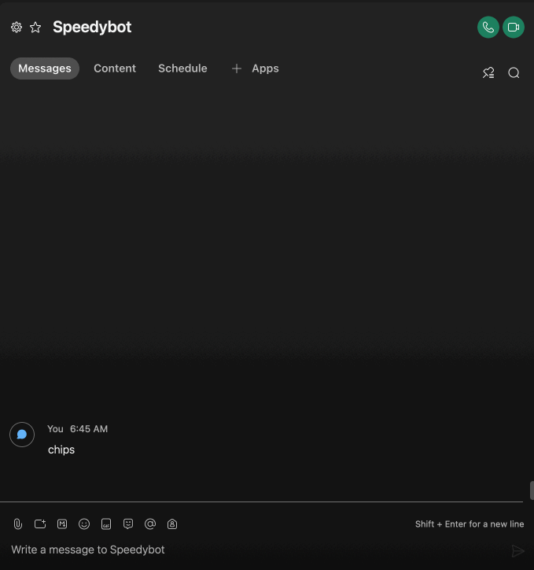

# 🏖 `speedybot hub` super-fast "no-ops" conversation design infrastructure

```
╔═╗ ╔═╗ ╔═╗ ╔═╗ ╔╦╗ ╦ ╦ ╔╗  ╔═╗ ╔╦╗
╚═╗ ╠═╝ ║╣  ║╣   ║║ ╚╦╝ ╠╩╗ ║ ║  ║
╚═╝ ╩   ╚═╝ ╚═╝ ═╩╝  ╩  ╚═╝ ╚═╝  ╩ HUB

tl:dr; serverless chat that actually works
```

See **[quickstart.md](https://github.com/valgaze/speedybot-hub/blob/deploy/quickstart.md)** on how to get up and running fast

📚 [API Docs](https://github.com/valgaze/speedybot-hub/blob/deploy/api-docs/modules.md)

Speedybot-hub is a zero-config and really fast central "hub" for all your conversation design needs

## Get up and running

Alternatively, go ahead and **[🍴Fork this repo🍴](https://github.com/valgaze/speedybot-hub/blob/deploy/docs/fork_guide.md)** for a zero-effort starter that'll take care of almost everything for you and let you focus on the conversation.

## Features

- 🌟 Zero External Dependencies 🌟
- Adds support tappable suggestion "chips"
- Optimized for **[V8 Isolates](https://developers.cloudflare.com/workers/learning/how-workers-works/)** for milisecond response times (🥶 no more cold start problems 🥶)
- Includes SpeedyCard card builder (create rich **[Adaptive Cards](https://developer.webex.com/docs/api/guides/cards)** without wrangling JSON)
- Locale & i18n support
- Supports multiple keywords for single handlers (without duplicating handlers)
- Auto-register webhooks using **[Github Actions](https://github.com/features/actions)** if you fork this repo, see **[here for details](./docs/fork_guide.md)**
- Edit conversation content & functionality directly in a browser-based editor
- "Magic" keywords to detect no match, run on every and many others (see **[below for details](#special-magic-keywords)**)

## Motivation

Think of a "hubs" as a central spots around which all your conversation design infrastructure + integrations + webhooks + all the rest can gather. You shouldn't have to think about anything but what matters in a conversation-- (1) the content + (2) useful/labor-savings rich integrations (files, location, sensors, etc)

Speedybot-hub takes care of virtually all of the "everything else" so all you and your team need to think about is about a single file, handlers.ts: **[settings/handlers.ts](https://github.com/valgaze/speedybot-hub/blob/deploy/settings/handlers.ts)** (And if you need further customization like supporting multiple languages, **[prompting users for permissions](https://github.com/valgaze/speedybot-hub/blob/deploy/docs/assets/demo_location.gif), **[validating webhook secrets](https://developer.webex.com/blog/building-a-more-secure-bot)**, etc see **[settings/config.ts](https://github.com/valgaze/speedybot-hub/blob/deploy/settings/config.ts)\*\* )

### Special "magic" keywords

The era of manually writing "handlers" or matching text with RegEx's is coming to an end. In the future there will be far fewer "keyword" handlers and instead deeper integration with 3rd-party conversation services like **[Voiceflow](https://www.voiceflow.com/)**, **[Amazon Lex](https://aws.amazon.com/lex/)**, **[DialogFlow](https://cloud.google.com/dialogflow/docs)**

Some things can't/shoudn't live inisde an NLU, these magic keywords allow you to hook into platform-specific details:

- <@catchall> (runs on every received message, useful when "passing" chat messages an NLU service and getting a response)
- <@submit> (capture the result of an **[AdaptiveCard](https://developer.webex.com/docs/api/guides/cards)** form submission)
- <@fileupload> (triggers when files uploaded-- `$bot.getFile` name and lots of other data
- <@nomatch> (runs when no handler, aside from <@catchall>, matches the input)

See the **[quickstart](./quickstart.md)** to get up and running

## SpeedyCard

ex. Tell the bot "sendcard" to get a card, type into the card & tap submit, catch submission using _<@submit>_ and echo back to user.

This card builder simplifies and standardizes cards


```ts
export const handlers = [
  {
    keyword: '<@submit>',
    handler(bot, trigger) {
      bot.say(
        `Submission received! You sent us ${JSON.stringify(
          trigger.attachmentAction.inputs
        )}`
      )
    },
    helpText: 'Special handler that fires when data is submitted',
  },
  {
    keyword: 'sendcard',
    handler($bot, trigger) {
      $bot.say('One card on the way...')
      // Adapative Card: https://developer.webex.com/docs/api/guides/cards
      const cardData = $bot
        .card({
          title: 'System is 👍',
          subTitle: 'If you see this card, everything is working',
          image:
            'https://raw.githubusercontent.com/valgaze/speedybot/master/docs/assets/chocolate_chip_cookies.png',
          url: 'https://www.youtube.com/watch?v=3GwjfUFyY6M',
          urlLabel: 'Take a moment to celebrate',
          table: [
            [`Bot's Date`, new Date().toDateString()],
            ["Bot's Uptime", '135.327998958s'],
          ],
        })
        .setInput(`What's on your mind?`)
        .setData({ mySpecialData: { a: 1, b: 2 } })

      $bot.send(cardData)
    },
    helpText: 'Sends an Adaptive Card with an input field to the user',
  },
]
```

## Suggestion "chips"

ex. Tap a "suggestion" to chip to trigger same behavior as if you tapped it yourself

Chips are useful to expose conversation agent features--



```ts
export const handlers = [
  {
    keyword: '<@submit>',
    handler(bot, trigger) {
      bot.say(
        `Submission received! You sent us ${JSON.stringify(
          trigger.attachmentAction.inputs
        )}`
      )
    },
    helpText: 'Special handler that fires when data is submitted',
  },
  {
    keyword: 'sendcard',
    handler($bot, trigger) {
      bot.say('One card on the way...')
      // Adapative Card: https://developer.webex.com/docs/api/guides/cards
      const cardData = $bot
        .card({
          title: 'System is 👍',
          subTitle: 'If you see this card, everything is working',
          image:
            'https://raw.githubusercontent.com/valgaze/speedybot/master/docs/assets/chocolate_chip_cookies.png',
          url: 'https://www.youtube.com/watch?v=3GwjfUFyY6M',
          urlLabel: 'Take a moment to celebrate',
          table: [
            [`Bot's Date`, new Date().toDateString()],
            ["Bot's Uptime", '135.327998958s'],
          ],
        })
        .setInput(`What's on your mind?`)
        .setData({ mySpecialData: { a: 1, b: 2 } })

      $bot.send(cardData)
    },
    helpText: 'Sends an Adaptive Card with an input field to the user',
  },
]
```
