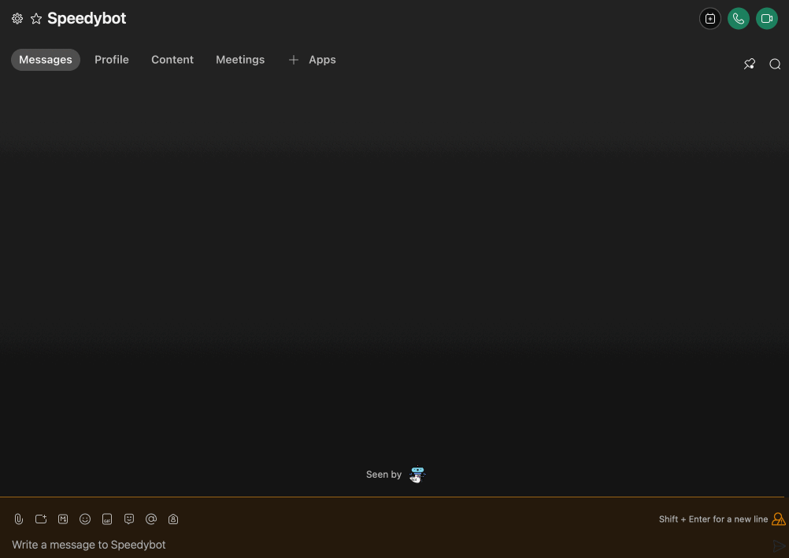
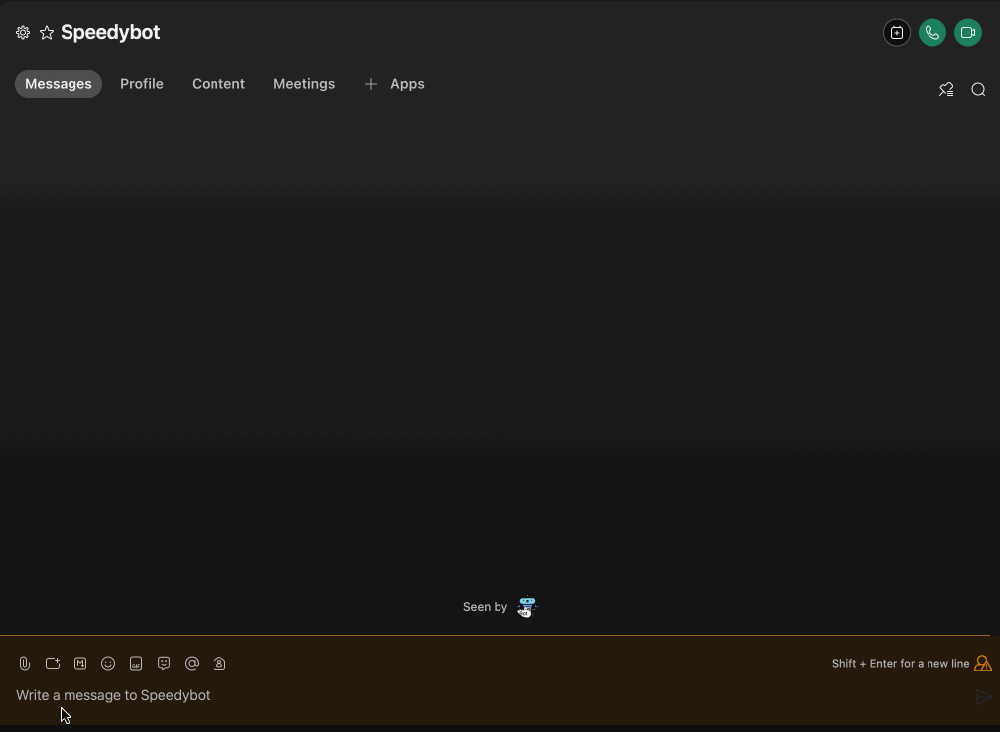

[speedybot-hub](../README.md) / [Exports](../modules.md) / BotRoot

# Class: BotRoot<T\>

Root bot object used in handlers-- enshrined with many convenience helpers & lessons learned the hard way



## Type parameters

| Name | Type |
| :------ | :------ |
| `T` | { `BOT_TOKEN`: `string`  } |

## Hierarchy

- **`BotRoot`**

  ↳ [`LocationAwareBot`](LocationAwareBot.md)

## Table of contents

### Constructors

- [constructor](BotRoot.md#constructor)

### Properties

- [API](BotRoot.md#api)
- [config](BotRoot.md#config)
- [env](BotRoot.md#env)
- [fallbackText](BotRoot.md#fallbacktext)
- [helpContent](BotRoot.md#helpcontent)
- [locales](BotRoot.md#locales)
- [meta](BotRoot.md#meta)
- [roomId](BotRoot.md#roomid)
- [token](BotRoot.md#token)

### Methods

- [api](BotRoot.md#api-1)
- [buildImLink](BotRoot.md#buildimlink)
- [buildLink](BotRoot.md#buildlink)
- [buildMeetingLink](BotRoot.md#buildmeetinglink)
- [buildSpaceLink](BotRoot.md#buildspacelink)
- [card](BotRoot.md#card)
- [clearScreen](BotRoot.md#clearscreen)
- [dangerCard](BotRoot.md#dangercard)
- [debugCard](BotRoot.md#debugcard)
- [deleteMessage](BotRoot.md#deletemessage)
- [dm](BotRoot.md#dm)
- [fillTemplate](BotRoot.md#filltemplate)
- [generateFileName](BotRoot.md#generatefilename)
- [generateHelp](BotRoot.md#generatehelp)
- [getFile](BotRoot.md#getfile)
- [getSelf](BotRoot.md#getself)
- [groupRoomGuard](BotRoot.md#grouproomguard)
- [guessContentType](BotRoot.md#guesscontenttype)
- [handleExtension](BotRoot.md#handleextension)
- [imageDetector](BotRoot.md#imagedetector)
- [locationAuthorizer](BotRoot.md#locationauthorizer)
- [log](BotRoot.md#log)
- [lookUp](BotRoot.md#lookup)
- [peekFile](BotRoot.md#peekfile)
- [pickRandom](BotRoot.md#pickrandom)
- [rando](BotRoot.md#rando)
- [say](BotRoot.md#say)
- [send](BotRoot.md#send)
- [sendCard](BotRoot.md#sendcard)
- [sendDataAsFile](BotRoot.md#senddataasfile)
- [sendDataFromUrl](BotRoot.md#senddatafromurl)
- [sendJSON](BotRoot.md#sendjson)
- [sendRandom](BotRoot.md#sendrandom)
- [sendSnippet](BotRoot.md#sendsnippet)
- [sendTemplate](BotRoot.md#sendtemplate)
- [sendURL](BotRoot.md#sendurl)
- [skyCard](BotRoot.md#skycard)
- [snippet](BotRoot.md#snippet)
- [stashCard](BotRoot.md#stashcard)
- [successCard](BotRoot.md#successcard)
- [thread](BotRoot.md#thread)
- [translate](BotRoot.md#translate)
- [voteFlag](BotRoot.md#voteflag)
- [warningCard](BotRoot.md#warningcard)

## Constructors

### constructor

• **new BotRoot**<`T`\>(`config`, `makeRequest?`)

#### Type parameters

| Name | Type |
| :------ | :------ |
| `T` | { `BOT_TOKEN`: `string`  } |

#### Parameters

| Name | Type | Default value |
| :------ | :------ | :------ |
| `config` | [`BotConfig`](../modules.md#botconfig)<`any`\> | `undefined` |
| `makeRequest` | (`url`: `string`, `body`: `any`, `opts`: `RequestOps`) => `Promise`<`Response`\> | `CoreMakerequest` |

#### Defined in

[lib/bot.ts:65](https://github.com/valgaze/speedybot-hub/blob/6ed96ba/src/lib/bot.ts#L65)

## Properties

### API

• `Private` **API**: `Object` = `API`

#### Type declaration

| Name | Type |
| :------ | :------ |
| `createWebhook` | `string` |
| `deleteMessage` | `string` |
| `deleteWebhook` | `string` |
| `getAttachmentDetails` | `string` |
| `getMembershipDetails` | `string` |
| `getMessageDetails` | `string` |
| `getPersonDetails` | `string` |
| `getSelf` | `string` |
| `getWebhooks` | `string` |
| `sendMessage` | `string` |

#### Defined in

[lib/bot.ts:63](https://github.com/valgaze/speedybot-hub/blob/6ed96ba/src/lib/bot.ts#L63)

___

### config

• **config**: [`BotConfig`](../modules.md#botconfig)<`any`\>

___

### env

• **env**: `T`

#### Defined in

[lib/bot.ts:49](https://github.com/valgaze/speedybot-hub/blob/6ed96ba/src/lib/bot.ts#L49)

___

### fallbackText

• `Private` **fallbackText**: `string` = `'Sorry, it appears your client does not support rendering Adaptive Cards, see here for more info: https://developer.webex.com/docs/api/guides/cards'`

#### Defined in

[lib/bot.ts:52](https://github.com/valgaze/speedybot-hub/blob/6ed96ba/src/lib/bot.ts#L52)

___

### helpContent

• `Private` **helpContent**: { `helpText`: `string` ; `label`: `string`  }[] = `[]`

#### Defined in

[lib/bot.ts:50](https://github.com/valgaze/speedybot-hub/blob/6ed96ba/src/lib/bot.ts#L50)

___

### locales

• **locales**: `Object` = `{}`

 Locales holder, passed in by Speedybot but hacky escape hatch available too

#### Defined in

[lib/bot.ts:62](https://github.com/valgaze/speedybot-hub/blob/6ed96ba/src/lib/bot.ts#L62)

___

### meta

• **meta**: `Object`

#### Type declaration

| Name | Type |
| :------ | :------ |
| `url` | `string` |

#### Defined in

[lib/bot.ts:55](https://github.com/valgaze/speedybot-hub/blob/6ed96ba/src/lib/bot.ts#L55)

___

### roomId

• `Private` **roomId**: `string` = `''`

#### Defined in

[lib/bot.ts:51](https://github.com/valgaze/speedybot-hub/blob/6ed96ba/src/lib/bot.ts#L51)

___

### token

• `Private` **token**: `string` = `''`

#### Defined in

[lib/bot.ts:54](https://github.com/valgaze/speedybot-hub/blob/6ed96ba/src/lib/bot.ts#L54)

## Methods

### api

▸ **api**<`T`\>(`request`, `requestInitr?`): `Promise`<`T`\>

Reach an api that returns JSON-- alias to fetch

```ts
{
 keyword: 'bingo',
 async handler($bot) {
   const adviceResponse = await $bot.api('https://api.adviceslip.com/advice')
   const adviceText = $bot.lookUp(adviceResponse, 'slip.advice')
   $bot.send(`Here' some advice: ${adviceText}`)
 }
}
```

#### Type parameters

| Name | Type |
| :------ | :------ |
| `T` | `any` |

#### Parameters

| Name | Type |
| :------ | :------ |
| `request` | `string` \| `Request` |
| `requestInitr?` | `Request` \| `RequestInit` |

#### Returns

`Promise`<`T`\>

#### Defined in

[lib/bot.ts:210](https://github.com/valgaze/speedybot-hub/blob/6ed96ba/src/lib/bot.ts#L210)

___

### buildImLink

▸ **buildImLink**(`target`, `label?`, `noBold?`): `string`

Build a markdown, click'able link to a specific person (1-1 space)

#### Parameters

| Name | Type | Default value | Description |
| :------ | :------ | :------ | :------ |
| `target` | `string` | `undefined` | (email) |
| `label?` | `string` | `undefined` |  |
| `noBold` | `boolean` | `false` |  |

#### Returns

`string`

#### Defined in

[lib/bot.ts:1379](https://github.com/valgaze/speedybot-hub/blob/6ed96ba/src/lib/bot.ts#L1379)

___

### buildLink

▸ **buildLink**(`target`, `label?`, `noBold?`): `string`

Generate a markdown link to a resource

#### Parameters

| Name | Type | Default value |
| :------ | :------ | :------ |
| `target` | `string` | `undefined` |
| `label?` | `string` | `undefined` |
| `noBold` | `boolean` | `false` |

#### Returns

`string`

markdown click'able link

#### Defined in

[lib/bot.ts:1346](https://github.com/valgaze/speedybot-hub/blob/6ed96ba/src/lib/bot.ts#L1346)

___

### buildMeetingLink

▸ **buildMeetingLink**(`target`, `label?`, `noBold?`): `string`

Build a markdown, click'able link to a meeting with a specific person)

#### Parameters

| Name | Type | Default value | Description |
| :------ | :------ | :------ | :------ |
| `target` | `string` | `undefined` | (email address) |
| `label?` | `string` | `undefined` |  |
| `noBold` | `boolean` | `false` |  |

#### Returns

`string`

#### Defined in

[lib/bot.ts:1363](https://github.com/valgaze/speedybot-hub/blob/6ed96ba/src/lib/bot.ts#L1363)

___

### buildSpaceLink

▸ **buildSpaceLink**(`target`, `label?`, `noBold?`): `string`

Build a markdown, click'able link to a specific space (OPT+CMD+K on Mac or CTRL-SHFT-K on windows to get space id)

#### Parameters

| Name | Type | Default value | Description |
| :------ | :------ | :------ | :------ |
| `target` | `string` | `undefined` | (email) |
| `label?` | `string` | `undefined` |  |
| `noBold` | `boolean` | `false` |  |

#### Returns

`string`

#### Defined in

[lib/bot.ts:1393](https://github.com/valgaze/speedybot-hub/blob/6ed96ba/src/lib/bot.ts#L1393)

___

### card

▸ **card**(`config?`): [`SpeedyCard`](SpeedyCard.md)

Convenience helper that creates a SpeedyCard


```ts
{
 keyword: 'bingo',
 async handler($bot, trigger) {
  const cardData = $bot.card({
    title: "Speedybot Hub",
    subTitle: "Sign the paperwork",
    chips: ["ping", "pong", "hi", "files"],
    image: "https://i.imgur.com/LybLW7J.gif",
    url: "https://github.com/valgaze/speedybot-hub"
  });
  $bot.send(cardData);

 }
}

```

#### Parameters

| Name | Type |
| :------ | :------ |
| `config` | `Partial`<[`AbbreviatedSpeedyCard`](../modules.md#abbreviatedspeedycard) & { `label`: `string`  }\> |

#### Returns

[`SpeedyCard`](SpeedyCard.md)

#### Defined in

[lib/bot.ts:403](https://github.com/valgaze/speedybot-hub/blob/6ed96ba/src/lib/bot.ts#L403)

___

### clearScreen

▸ **clearScreen**(`repeatCount?`): `Promise`<`void`\>

Clear the screen on desktop clients (useful for demos)

```ts
{
 keyword: 'bingo',
 handler($bot) {
   $bot.say('Clearing screen...')
   $bot.clearScreen()
 }
}
```

#### Parameters

| Name | Type | Default value |
| :------ | :------ | :------ |
| `repeatCount` | `number` | `50` |

#### Returns

`Promise`<`void`\>

#### Defined in

[lib/bot.ts:1103](https://github.com/valgaze/speedybot-hub/blob/6ed96ba/src/lib/bot.ts#L1103)

___

### dangerCard

▸ **dangerCard**(`payload?`): [`SpeedyCard`](SpeedyCard.md)

Returns an instance of a dangerCard. dangerCards have blue skylike background:



```ts
{
 keyword: 'bingo',
 async handler($bot) {
   const danger = $bot.dangerCard({
    title: '⛔️DANGER-- do not do that!⛔️',
    subTitle: 'There is a very important reason not to do that',
    chips: ['ping', 'pong'],
   })
 $bot.send(danger)
 }
}
```

#### Parameters

| Name | Type | Description |
| :------ | :------ | :------ |
| `payload` | `Partial`<[`AbbreviatedSpeedyCard`](../modules.md#abbreviatedspeedycard)\> | (title, subtitle, etc) |

#### Returns

[`SpeedyCard`](SpeedyCard.md)

SpeedyCard

#### Defined in

[lib/bot.ts:1223](https://github.com/valgaze/speedybot-hub/blob/6ed96ba/src/lib/bot.ts#L1223)

___

### debugCard

▸ **debugCard**(`payload?`): [`SpeedyCard`](SpeedyCard.md)

Returns an instance of a debugCard


```ts
{
 keyword: 'bingo',
 async handler($bot) {
   const debug = $bot.debugCard({
    title: 'Testing 321',
    subTitle: 'Testing 456',
    chips: ['ping', 'pong'],
   })
 $bot.send(danger)
 }
}
```

#### Parameters

| Name | Type | Description |
| :------ | :------ | :------ |
| `payload` | `Partial`<[`AbbreviatedSpeedyCard`](../modules.md#abbreviatedspeedycard)\> | (title, subtitle, etc) |

#### Returns

[`SpeedyCard`](SpeedyCard.md)

SpeedyCard

#### Defined in

[lib/bot.ts:1250](https://github.com/valgaze/speedybot-hub/blob/6ed96ba/src/lib/bot.ts#L1250)

___

### deleteMessage

▸ **deleteMessage**(`messageId`): `Promise`<`Response`\>

Delete a message (need a valid messageId)

```ts
{
 keyword: 'bingo',
 async handler($bot, trigger) {
  const msg = await $bot.send('My message to be deleted')
  $bot.deleteMessage(msg.id)
 }
}

```

#### Parameters

| Name | Type |
| :------ | :------ |
| `messageId` | `string` |

#### Returns

`Promise`<`Response`\>

#### Defined in

[lib/bot.ts:514](https://github.com/valgaze/speedybot-hub/blob/6ed96ba/src/lib/bot.ts#L514)

___

### dm

▸ **dm**(`personIdOrEmail`, `message`, `fallback?`): `Promise`<`Response`\>

Send a 1-1/DM message to a user based on their email or personId

You can send a string or a card

```ts
{
 keyword: 'biscotti',
 async handler($bot, trigger) {

 $bot.dm('username@domain.com', 'Here is a secret message')

 $bot.dm('aaa-bbb-ccc-ddd-eee', $bot.card({title:'biscotti', subTitle:'Is it biscotti or biscotto?', chips:['biscotti','biscotto']}))

 }
}
```

#### Parameters

| Name | Type |
| :------ | :------ |
| `personIdOrEmail` | `string` |
| `message` | `string` \| `string`[] \| [`SpeedyCard`](SpeedyCard.md) |
| `fallback?` | `string` |

#### Returns

`Promise`<`Response`\>

#### Defined in

[lib/bot.ts:243](https://github.com/valgaze/speedybot-hub/blob/6ed96ba/src/lib/bot.ts#L243)

___

### fillTemplate

▸ `Private` **fillTemplate**(`utterances`, `template`): `any`

Fill in a template (usually used by sendTemplate)
```ts
  const utterances = ['Howdy $[name], here's $[flavor]', '$[name], here\'s your $[flavor] ice cream']
  const template = { name: 'Joe', flavor: 'strawberry' }
  const response = $bot.fillTemplate(utterances, template) // "Joe, here's your strawberry ice cream"

  const response2 = $bot.fillTemplate('Hi there the time is $[date]', {date: new Date().toString()})
```

#### Parameters

| Name | Type |
| :------ | :------ |
| `utterances` | `string`[] |
| `template` | `any` |

#### Returns

`any`

#### Defined in

[lib/bot.ts:126](https://github.com/valgaze/speedybot-hub/blob/6ed96ba/src/lib/bot.ts#L126)

___

### generateFileName

▸ `Private` **generateFileName**(): `string`

#### Returns

`string`

#### Defined in

[lib/bot.ts:773](https://github.com/valgaze/speedybot-hub/blob/6ed96ba/src/lib/bot.ts#L773)

___

### generateHelp

▸ **generateHelp**(): { `helpText`: `string` ; `label`: `string`  }[]

#### Returns

{ `helpText`: `string` ; `label`: `string`  }[]

#### Defined in

[lib/bot.ts:769](https://github.com/valgaze/speedybot-hub/blob/6ed96ba/src/lib/bot.ts#L769)

___

### getFile

▸ **getFile**(`url`, `opts?`): `Promise`<{ `data`: `any` ; `extension`: `string` ; `fileName`: `string` ; `markdownSnippet`: `string` ; `type`: `string`  }\>

Get a (secured) file's contents, probably would use this for examining uploaded files
like JSON, excel (xlsx), etc

#### Parameters

| Name | Type |
| :------ | :------ |
| `url` | `string` |
| `opts` | `Object` |
| `opts.responseType?` | ``"json"`` \| ``"arraybuffer"`` |

#### Returns

`Promise`<{ `data`: `any` ; `extension`: `string` ; `fileName`: `string` ; `markdownSnippet`: `string` ; `type`: `string`  }\>

```ts
{
 keyword: '<@fileupload>',
 async handler(bot, trigger) {
       const [fileUrl] = trigger.message.files || []
  const fileData = await $bot.getFile(fileUrl, {
    responseType: 'arraybuffer',
  })
  const { fileName, extension, type } = fileData
  $bot.say(
    `The file you uploaded (${fileName}), is a ${extension} file of type ${type}`
  )
   // with fileData.data you have access to an arrayBuffer with the raw bytes of that file
 }
}
```

#### Defined in

[lib/bot.ts:713](https://github.com/valgaze/speedybot-hub/blob/6ed96ba/src/lib/bot.ts#L713)

___

### getSelf

▸ **getSelf**(): `Promise`<`SelfData`\>

Get bot's meta data

```ts
{
 keyword: 'bingo',
 async handler($bot) {
   const botData = await $bot.getSelf()
   $bot.send(`Hi I'm a bot & my name is ${botData.displayName}`)
 }
}

```

#### Returns

`Promise`<`SelfData`\>

#### Defined in

[lib/bot.ts:484](https://github.com/valgaze/speedybot-hub/blob/6ed96ba/src/lib/bot.ts#L484)

___

### groupRoomGuard

▸ **groupRoomGuard**(`trigger`): { `card`: [`SpeedyCard`](SpeedyCard.md) ; `text`: `string` ; `violation`: `boolean`  } \| { `card`: ``null`` ; `text`: ``null`` ; `violation`: `boolean`  }

Helper to restrict invocation of commands in group rooms

TODO: make this config option on handlers directory
restrict to certain users, etc

#### Parameters

| Name | Type |
| :------ | :------ |
| `trigger` | `TRIGGERS` |

#### Returns

{ `card`: [`SpeedyCard`](SpeedyCard.md) ; `text`: `string` ; `violation`: `boolean`  } \| { `card`: ``null`` ; `text`: ``null`` ; `violation`: `boolean`  }

a null text/card if the trigger doesn't belong to a group room or premade card + text

#### Defined in

[lib/bot.ts:1456](https://github.com/valgaze/speedybot-hub/blob/6ed96ba/src/lib/bot.ts#L1456)

___

### guessContentType

▸ `Private` **guessContentType**(`extensionOrFileName`): ``null`` \| `string`

#### Parameters

| Name | Type |
| :------ | :------ |
| `extensionOrFileName` | `string` |

#### Returns

``null`` \| `string`

#### Defined in

[lib/bot.ts:884](https://github.com/valgaze/speedybot-hub/blob/6ed96ba/src/lib/bot.ts#L884)

___

### handleExtension

▸ `Private` **handleExtension**(`input?`): `string`

#### Parameters

| Name | Type | Default value |
| :------ | :------ | :------ |
| `input` | `string` | `''` |

#### Returns

`string`

#### Defined in

[lib/bot.ts:784](https://github.com/valgaze/speedybot-hub/blob/6ed96ba/src/lib/bot.ts#L784)

___

### imageDetector

▸ **imageDetector**(`token`): `VisionHelper`

Returns an image detector (currently supports only google vision, but support for more providers)

 ```ts
{
  keyword: '<@camera>',
  async handler($bot, trigger: FILE_TRIGGER) {
    const [fileUrl] = trigger.message.files || []
    const fileData = await $bot.getFile(fileUrl, {
      responseType: 'arraybuffer',
    })
    const { data } = fileData
    try {
      // Run image recognition
      const detector = $bot.imageDetector($bot.env.VISION_TOKEN)

      // 1) convert array buffer to base64
      const base64 = detector.toBase64(data)

      // 2) transmit data and retrieve labels
      const res = await detector.detect(base64)

      if ('error' in res && res.error.code === 401) {
        const err = new Error()
        err.message = 'VISION_TOKEN is invalid'
        throw err
      } else if ('responses' in res) {
        // 3) Create a single list of all detections
        const simplified = detector.simplify(res)

        await $bot.send(`Here are some detections...`)
        $bot.sendSnippet(simplified)
      }
    } catch (e: any) {
      await $bot.send('There was a catastrophic issue with the vision tool')
      $bot.send(
        $bot
          .dangerCard({
            title: 'Vision is not enabled for this agent',
            subTitle: e.message ? e.message : 'Vision service has issues',
          })
      )
    }
  },
}
```
Returns image detector

#### Parameters

| Name | Type |
| :------ | :------ |
| `token` | `string` |

#### Returns

`VisionHelper`

#### Defined in

[lib/bot.ts:672](https://github.com/valgaze/speedybot-hub/blob/6ed96ba/src/lib/bot.ts#L672)

___

### locationAuthorizer

▸ **locationAuthorizer**(`trigger`, `message?`, `config?`): `Promise`<`void`\>

Location Authorizer
Ask the user for access to their location, if they provide permission run location authorizer

You can use their timezone to determine greetings (morning/afternoon/evening) and other
surrounding "context" about the user

NOTE: This location data is deliberately imprecise-- the best you can expect is to know if
it is light/dark outside the user's location, timezone, country, etc

NOTE: this may have compliance implications for your team/organization

NOTE: The "handler" for location exists on the root configuration object under "location"

```ts
{
 keyword: 'bingo',
 async handler(bot, trigger) {
  // minimal amount needed
  $bot.locationAuthorizer(trigger)

   // with all options
  $bot.locationAuthorizer(trigger, 'Here is some important information', {
     url: 'http://www.privacy.com',
     urlLabel: 'Privacy policy',
     labels: { yes: 'yep', no: 'nope'}
   })
 }
}
```


#### Parameters

| Name | Type |
| :------ | :------ |
| `trigger` | `MESSAGE_TRIGGER` \| `FILE_TRIGGER` |
| `message?` | `string` |
| `config?` | `Object` |
| `config.labels?` | `Object` |
| `config.labels.no?` | `string` |
| `config.labels.yes?` | `string` |
| `config.url?` | `string` |
| `config.urlLabel?` | `string` |

#### Returns

`Promise`<`void`\>

#### Defined in

[lib/bot.ts:561](https://github.com/valgaze/speedybot-hub/blob/6ed96ba/src/lib/bot.ts#L561)

___

### log

▸ **log**(...`payload`): `void`

Logs to system

```ts
{
 keyword: 'bingo',
 handler($bot) {
   $bot.log('Testing 123')
 }
}
```

#### Parameters

| Name | Type |
| :------ | :------ |
| `...payload` | `any` |

#### Returns

`void`

#### Defined in

[lib/bot.ts:1073](https://github.com/valgaze/speedybot-hub/blob/6ed96ba/src/lib/bot.ts#L1073)

___

### lookUp

▸ **lookUp**(`locale`, `lookup?`, `fallback?`): `any`

Traverse a property lookup path on a object
fallback to a value (if provided) whenever
path is invalid

```ts
{
 keyword: 'bingo',
 async handler($bot) {
   const myData = {a:1,b:2,c:{d:3}}
   const res = $bot.lookUp(myData, 'a.b.c.d', 'fallback') // 3
   const fail = $bot.lookUp(myData, 'a.b.ce.e.f.g', 'fallback') // 'fallback'
 }
}
```

#### Parameters

| Name | Type | Default value |
| :------ | :------ | :------ |
| `locale` | `any` | `undefined` |
| `lookup` | `string` | `''` |
| `fallback?` | `string` | `undefined` |

#### Returns

`any`

#### Defined in

[lib/bot.ts:1186](https://github.com/valgaze/speedybot-hub/blob/6ed96ba/src/lib/bot.ts#L1186)

___

### peekFile

▸ **peekFile**(`url`): `Promise`<{ `extension`: `string` ; `fileName`: `string` ; `type`: `string`  }\>

Cheap way to get content-dispoition header & content-type and get extension

#### Parameters

| Name | Type |
| :------ | :------ |
| `url` | `string` |

#### Returns

`Promise`<{ `extension`: `string` ; `fileName`: `string` ; `type`: `string`  }\>

#### Defined in

[lib/bot.ts:682](https://github.com/valgaze/speedybot-hub/blob/6ed96ba/src/lib/bot.ts#L682)

___

### pickRandom

▸ **pickRandom**(`list?`): `any`

Grab a random element from a list
```ts
const list = [1, 2, 3];
const $bot = { pickRandom(x: any[]) {} };
$bot.pickRandom(list); // 2
```

#### Parameters

| Name | Type | Default value |
| :------ | :------ | :------ |
| `list` | `any`[] | `[]` |

#### Returns

`any`

#### Defined in

[lib/bot.ts:100](https://github.com/valgaze/speedybot-hub/blob/6ed96ba/src/lib/bot.ts#L100)

___

### rando

▸ **rando**(): `string`

Generate a random string of 11 characters (letters + numbers)

#### Returns

`string`

#### Defined in

[lib/bot.ts:780](https://github.com/valgaze/speedybot-hub/blob/6ed96ba/src/lib/bot.ts#L780)

___

### say

▸ **say**<`T`\>(`payload`): `Promise`<`T`\>

Legacy alias for $bot.send

#### Type parameters

| Name | Type |
| :------ | :------ |
| `T` | `any` |

#### Parameters

| Name | Type |
| :------ | :------ |
| `payload` | `string` \| `ToMessage` \| `Card` \| { `[key: string]`: `string` \| `number` \| `any`; `roomId`: `string`  } |

#### Returns

`Promise`<`T`\>

#### Defined in

[lib/bot.ts:1497](https://github.com/valgaze/speedybot-hub/blob/6ed96ba/src/lib/bot.ts#L1497)

___

### send

▸ **send**<`T`\>(`payload`): `Promise`<`T`\>

$bot.send, core "workhorse" utility that can send whatever you throw at it
roomId by default is whatever is bound to bot instance

```ts
{
 keyword: 'bingo',
 async handler($bot, trigger) {
 // Send a simple string
 $bot.send('Send a string')

 // Send a card: https://developer.webex.com/docs/api/guides/cards
 $bot.send($bot.card({title:'My special card', subTitle:'My great subtitle', chips:['ping','pong','hi']}))

 // Send a traditional ToMessage
 const payload = {
   toPersonEmail: 'fake_name@org.com',
   markdown: 'some **great** content',
 }
 $bot.send(payload)
 }
}
```

#### Type parameters

| Name | Type |
| :------ | :------ |
| `T` | `MessageReply` |

#### Parameters

| Name | Type |
| :------ | :------ |
| `payload` | `string` \| `ToMessage` \| `Card` |

#### Returns

`Promise`<`T`\>

#### Defined in

[lib/bot.ts:314](https://github.com/valgaze/speedybot-hub/blob/6ed96ba/src/lib/bot.ts#L314)

___

### sendCard

▸ **sendCard**<`T`\>(`payload`): `Promise`<`T`\>

Legacy alias for $bot.sendCard

#### Type parameters

| Name | Type |
| :------ | :------ |
| `T` | `any` |

#### Parameters

| Name | Type |
| :------ | :------ |
| `payload` | `Card` |

#### Returns

`Promise`<`T`\>

#### Defined in

[lib/bot.ts:1512](https://github.com/valgaze/speedybot-hub/blob/6ed96ba/src/lib/bot.ts#L1512)

___

### sendDataAsFile

▸ **sendDataAsFile**(`data`, `extensionOrFileName`, `contentType?`, `textLabel?`, `overrides?`): `Promise`<`Response`\>

Generate a file and fill it with the data you provide and send to user to download

At minimum, provide the file data & desired file extension

```ts
{
 keyword: 'bingo',
 async handler($bot) {
   const myData = { a: 1, b: 2, c: [1,2,3,'hello', 'bonjour']}
   $bot.sendDataAsFile(myData, 'json')
 }
}

```

#### Parameters

| Name | Type | Default value |
| :------ | :------ | :------ |
| `data` | `any` | `undefined` |
| `extensionOrFileName` | `string` | `undefined` |
| `contentType` | ``null`` | `null` |
| `textLabel?` | `string` | `undefined` |
| `overrides` | `Object` | `{}` |
| `overrides.roomId?` | `string` | `undefined` |
| `overrides.toPersonEmail?` | `string` | `undefined` |
| `overrides.toPersonId?` | `string` | `undefined` |

#### Returns

`Promise`<`Response`\>

#### Defined in

[lib/bot.ts:821](https://github.com/valgaze/speedybot-hub/blob/6ed96ba/src/lib/bot.ts#L821)

___

### sendDataFromUrl

▸ **sendDataFromUrl**(`url`, `fallbackText?`): `Promise`<`MessageReply`\>

Provide a URL but it gets returned as a file

Filetypes: 'doc', 'docx', 'xls', 'xlsx', 'ppt', 'pptx', 'pdf', 'jpg', 'jpeg', 'bmp', 'gif', 'png'
See more info here: https://developer.webex.com/docs/basics

```ts
{
 keyword: 'bingo',
 handler($bot) {
   const pdfURL = 'https://speedybot.valgaze.com'
   $bot.sendDataFromUrl(pdfURL, "Here's a doc!")
 }
}
```

#### Parameters

| Name | Type | Default value |
| :------ | :------ | :------ |
| `url` | `string` | `undefined` |
| `fallbackText` | `string` | `' '` |

#### Returns

`Promise`<`MessageReply`\>

#### Defined in

[lib/bot.ts:1054](https://github.com/valgaze/speedybot-hub/blob/6ed96ba/src/lib/bot.ts#L1054)

___

### sendJSON

▸ **sendJSON**<`T`\>(`data`, `label?`): `Promise`<`void`\>

Display a snippet of nicely-formatted (alias for $bot.sendSnippet)
JSON data or code-snippet to the user

```ts
{
 keyword: 'bingo',
 async handler($bot) {
   const specialData = {a:1, b:2, c: [1,2,3]}
   $bot.sendJSON(specialData)
 }
}
```

#### Type parameters

| Name | Type |
| :------ | :------ |
| `T` | `any` |

#### Parameters

| Name | Type |
| :------ | :------ |
| `data` | `T` |
| `label?` | `string` |

#### Returns

`Promise`<`void`\>

#### Defined in

[lib/bot.ts:1129](https://github.com/valgaze/speedybot-hub/blob/6ed96ba/src/lib/bot.ts#L1129)

___

### sendRandom

▸ **sendRandom**(`list?`): `Promise`<`MessageReply`\>

Grab a random element from a list
```ts
const list = ['hi, 'hello', 'yo'];
$bot.sendRandom(list); // 'hello'
```

#### Parameters

| Name | Type | Default value |
| :------ | :------ | :------ |
| `list` | `any`[] | `[]` |

#### Returns

`Promise`<`MessageReply`\>

#### Defined in

[lib/bot.ts:111](https://github.com/valgaze/speedybot-hub/blob/6ed96ba/src/lib/bot.ts#L111)

___

### sendSnippet

▸ **sendSnippet**(`data`, `label?`, `dataType?`, `fallbackText?`): `Promise`<`void`\>

Display a snippet to the user

```ts
{
 keyword: 'bingo',
 async handler($bot) {
   const specialData = {a:1, b:2, c: [1,2,3]}
   $bot.sendSnippet(specialData)
 }
}
```

#### Parameters

| Name | Type | Default value |
| :------ | :------ | :------ |
| `data` | `string` \| `object` | `undefined` |
| `label` | `string` | `''` |
| `dataType` | `string` | `'json'` |
| `fallbackText?` | `string` | `undefined` |

#### Returns

`Promise`<`void`\>

#### Defined in

[lib/bot.ts:1146](https://github.com/valgaze/speedybot-hub/blob/6ed96ba/src/lib/bot.ts#L1146)

___

### sendTemplate

▸ **sendTemplate**(`utterances`, `template?`): `Promise`<`MessageReply`\>

Send a url wrapped in a card

```ts
{
 keyword: 'bingo',
 async handler($bot, trigger) {
  const utterances = [
    'Howdy $[name], here is a $[flavor]',
    '$[name], one $[flavor] ice cream for you',
  ]
  const template = { name: 'Joe', flavor: 'strawberry' }
  $bot.sendTemplate(utterances, template)

 }
}

```

#### Parameters

| Name | Type |
| :------ | :------ |
| `utterances` | `string`[] |
| `template` | `any` |

#### Returns

`Promise`<`MessageReply`\>

#### Defined in

[lib/bot.ts:161](https://github.com/valgaze/speedybot-hub/blob/6ed96ba/src/lib/bot.ts#L161)

___

### sendURL

▸ **sendURL**(`url`, `title?`, `buttonTitle?`): `Promise`<`MessageReply`\>

Send a url wrapped in a card

```ts
{
 keyword: 'bingo',
 async handler($bot, trigger) {
  const url = 'https://codepen.io/valgaze/pen/PoEpxpb'
  $bot.sendURL(url, 'Check this out', '💫 See Resource')
 }
}

```

#### Parameters

| Name | Type | Default value |
| :------ | :------ | :------ |
| `url` | `string` | `undefined` |
| `title?` | `string` | `undefined` |
| `buttonTitle` | `string` | `'Go'` |

#### Returns

`Promise`<`MessageReply`\>

#### Defined in

[lib/bot.ts:182](https://github.com/valgaze/speedybot-hub/blob/6ed96ba/src/lib/bot.ts#L182)

___

### skyCard

▸ **skyCard**(`payload?`): [`SpeedyCard`](SpeedyCard.md)

Returns an instance of a skyCard. SkyCards have blue skylike background:


```ts
{
 keyword: 'bingo',
 async handler($bot) {
   const card = $bot.skyCard({title: '☁️ What a pleasant card ☁️'})
   $bot.send(card)
 }
}
```

#### Parameters

| Name | Type | Description |
| :------ | :------ | :------ |
| `payload` | `Partial`<[`AbbreviatedSpeedyCard`](../modules.md#abbreviatedspeedycard)\> | (title, subtitle, etc) |

#### Returns

[`SpeedyCard`](SpeedyCard.md)

SpeedyCard

#### Defined in

[lib/bot.ts:1333](https://github.com/valgaze/speedybot-hub/blob/6ed96ba/src/lib/bot.ts#L1333)

___

### snippet

▸ **snippet**(`data`, `dataType?`): `string`

Takes input data and wraps in markdown backticks

#### Parameters

| Name | Type | Default value |
| :------ | :------ | :------ |
| `data` | `any` | `undefined` |
| `dataType` | `string` | `'json'` |

#### Returns

`string`

#### Defined in

[lib/bot.ts:1083](https://github.com/valgaze/speedybot-hub/blob/6ed96ba/src/lib/bot.ts#L1083)

___

### stashCard

▸ **stashCard**(`secret`, `message?`): [`SpeedyCard`](SpeedyCard.md)

Temporary card that you can stash away data and destroy

#### Parameters

| Name | Type |
| :------ | :------ |
| `secret` | `string` |
| `message?` | `string` |

#### Returns

[`SpeedyCard`](SpeedyCard.md)

#### Defined in

[lib/bot.ts:614](https://github.com/valgaze/speedybot-hub/blob/6ed96ba/src/lib/bot.ts#L614)

___

### successCard

▸ **successCard**(`payload?`): [`SpeedyCard`](SpeedyCard.md)

Returns an instance of a SuccessCard. SuccessCards have blue skylike background:


```ts
{
 keyword: 'bingo',
 async handler($bot) {
   const success = $bot.successCard({
    title: '🌟You did it!🎉',
    subTitle: 'Whatever you did, good at job at doing it',
    chips: ['ping', 'pong'],
   })
 $bot.send(success)
 }
}
```

#### Parameters

| Name | Type | Description |
| :------ | :------ | :------ |
| `payload` | `Partial`<[`AbbreviatedSpeedyCard`](../modules.md#abbreviatedspeedycard)\> | (title, subtitle, etc) |

#### Returns

[`SpeedyCard`](SpeedyCard.md)

SpeedyCard

#### Defined in

[lib/bot.ts:1308](https://github.com/valgaze/speedybot-hub/blob/6ed96ba/src/lib/bot.ts#L1308)

___

### thread

▸ **thread**(`thread`): `Promise`<`void`\>

Send a message with a reply

Restrictions :(
- Only 1st message can be a card
- Replies can only be strings

#### Parameters

| Name | Type | Description |
| :------ | :------ | :------ |
| `thread` | [`string` \| [`SpeedyCard`](SpeedyCard.md), ...(string \| ToMessage)[]] | ex $bot.thread([$bot.card().setTitle('hello world!').setChips(['a','b','c']), 'Pick one of the above!']) |

#### Returns

`Promise`<`void`\>

#### Defined in

[lib/bot.ts:952](https://github.com/valgaze/speedybot-hub/blob/6ed96ba/src/lib/bot.ts#L952)

___

### translate

▸ **translate**(`locale`, `lookup`, `template?`, `fallback?`): `any`

Translate a string based on provided locale config

```ts
// locale data (gets specified into Speedybot-hub config)
const locales = {
 en: {
   greetings: {
     welcome: 'Hello!!'
   }
 },
 es: {
   greetings: {
     welcome: 'hola!!'
   }
 },
 cn: {
   greetings: {
     welcome: '你好'
   }
 }
}

const config = {
 token: 'abc',
 locales
}
const handlers = []
const hub = new SpeedybotHub(config, handlers, env)

// in handlers list
{
 keyword: 'bingo',
 handler($bot) {
   const eng = $bot.translate('en', 'greetings.welcome')
   const esp = $bot.translate('es', 'greetings.welcome')
   const chn = $bot.translate('cn', 'greetings.welcome')
   const fallback = $bot.translate('whoops_doesnt_exist', 'greetings.welcome', 'Hey there fallback!')
   $bot.send(`${eng}, ${esp}, ${chn}, ${fallback}`)
 }
}

```

#### Parameters

| Name | Type | Default value |
| :------ | :------ | :------ |
| `locale` | `string` | `undefined` |
| `lookup` | `string` | `undefined` |
| `template` | `Object` | `{}` |
| `fallback` | `string` | `''` |

#### Returns

`any`

#### Defined in

[lib/bot.ts:1022](https://github.com/valgaze/speedybot-hub/blob/6ed96ba/src/lib/bot.ts#L1022)

___

### voteFlag

▸ **voteFlag**(`votes`, `payload?`): `Promise`<`void`\>

Display a voting system-- each vote tap is guaranteed to at least contain
a field "vote" with the user's selection

#### Parameters

| Name | Type | Description |
| :------ | :------ | :------ |
| `votes` | [a: string, b: string, c?: string, d?: string, e?: string] | (items to vote on, min 2, max 5) |
| `payload` | `Object` | (any data you want to attach to each vote (roomId could be useful)) |

#### Returns

`Promise`<`void`\>

#### Defined in

[lib/bot.ts:1410](https://github.com/valgaze/speedybot-hub/blob/6ed96ba/src/lib/bot.ts#L1410)

___

### warningCard

▸ **warningCard**(`payload?`): [`SpeedyCard`](SpeedyCard.md)

Returns an instance of a SuccessCard. SuccessCards have blue skylike background:


```ts
{
 keyword: 'bingo',
 async handler($bot) {
   const warning = $bot.successCard({
    title: '⚠️Warning-- you should consider carefully if you want to do that!⚠️',
    subTitle: 'There is a very important reason to slow down and consider if you want to do that...or not',
    chips: ['ping', 'pong'],
   })
 $bot.send(warning)
 }
}
```

#### Parameters

| Name | Type | Description |
| :------ | :------ | :------ |
| `payload` | `Partial`<[`AbbreviatedSpeedyCard`](../modules.md#abbreviatedspeedycard)\> | (title, subtitle, etc) |

#### Returns

[`SpeedyCard`](SpeedyCard.md)

SpeedyCard

#### Defined in

[lib/bot.ts:1279](https://github.com/valgaze/speedybot-hub/blob/6ed96ba/src/lib/bot.ts#L1279)
