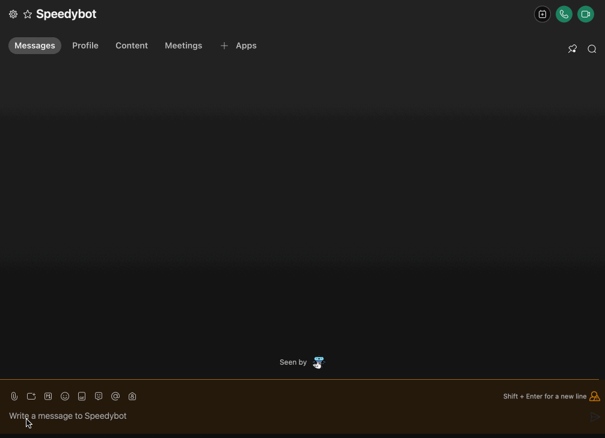

[speedybot-hub](../README.md) / [Exports](../modules.md) / LocationAwareBot

# Class: LocationAwareBot

## Hierarchy

- [`BotRoot`](BotRoot.md)

  ↳ **`LocationAwareBot`**

## Table of contents

### Constructors

- [constructor](LocationAwareBot.md#constructor)

### Properties

- [config](LocationAwareBot.md#config)
- [env](LocationAwareBot.md#env)
- [locales](LocationAwareBot.md#locales)
- [location](LocationAwareBot.md#location)
- [meta](LocationAwareBot.md#meta)

### Methods

- [api](LocationAwareBot.md#api)
- [card](LocationAwareBot.md#card)
- [clearScreen](LocationAwareBot.md#clearscreen)
- [dangerCard](LocationAwareBot.md#dangercard)
- [deleteMessage](LocationAwareBot.md#deletemessage)
- [dm](LocationAwareBot.md#dm)
- [generateHelp](LocationAwareBot.md#generatehelp)
- [getFile](LocationAwareBot.md#getfile)
- [getSelf](LocationAwareBot.md#getself)
- [locationAuthorizer](LocationAwareBot.md#locationauthorizer)
- [log](LocationAwareBot.md#log)
- [lookUp](LocationAwareBot.md#lookup)
- [pickRandom](LocationAwareBot.md#pickrandom)
- [rando](LocationAwareBot.md#rando)
- [say](LocationAwareBot.md#say)
- [send](LocationAwareBot.md#send)
- [sendCard](LocationAwareBot.md#sendcard)
- [sendDataAsFile](LocationAwareBot.md#senddataasfile)
- [sendDataFromUrl](LocationAwareBot.md#senddatafromurl)
- [sendJSON](LocationAwareBot.md#sendjson)
- [sendRandom](LocationAwareBot.md#sendrandom)
- [sendSnippet](LocationAwareBot.md#sendsnippet)
- [sendTemplate](LocationAwareBot.md#sendtemplate)
- [sendURL](LocationAwareBot.md#sendurl)
- [skyCard](LocationAwareBot.md#skycard)
- [snippet](LocationAwareBot.md#snippet)
- [successCard](LocationAwareBot.md#successcard)
- [thread](LocationAwareBot.md#thread)
- [translate](LocationAwareBot.md#translate)
- [warningCard](LocationAwareBot.md#warningcard)

## Constructors

### constructor

• **new LocationAwareBot**(`config`, `incomingLocationData`)

#### Parameters

| Name | Type |
| :------ | :------ |
| `config` | [`BotConfig`](../modules.md#botconfig)<`any`\> |
| `incomingLocationData` | `Partial`<{ `city`: `string` ; `colo`: `string` ; `continent`: `string` ; `country`: `string` ; `latitude`: `string` ; `longitude`: `string` ; `postalCode`: `string` ; `region`: `string` ; `timezone`: `string`  }\> |

#### Overrides

[BotRoot](BotRoot.md).[constructor](BotRoot.md#constructor)

#### Defined in

[lib/location.ts:99](https://github.com/valgaze/speedybot-hub/blob/c3263c6/src/lib/location.ts#L99)

## Properties

### config

• **config**: [`BotConfig`](../modules.md#botconfig)<`any`\>

#### Inherited from

[BotRoot](BotRoot.md).[config](BotRoot.md#config)

___

### env

• **env**: `Object`

#### Type declaration

| Name | Type |
| :------ | :------ |
| `BOT_TOKEN` | `string` |

#### Inherited from

[BotRoot](BotRoot.md).[env](BotRoot.md#env)

#### Defined in

[lib/bot.ts:45](https://github.com/valgaze/speedybot-hub/blob/c3263c6/src/lib/bot.ts#L45)

___

### locales

• **locales**: `Object` = `{}`

 Locales holder, passed in by Speedybot but hacky escape hatch available too

#### Inherited from

[BotRoot](BotRoot.md).[locales](BotRoot.md#locales)

#### Defined in

[lib/bot.ts:58](https://github.com/valgaze/speedybot-hub/blob/c3263c6/src/lib/bot.ts#L58)

___

### location

• **location**: `Object` = `defaultLocationData`

#### Type declaration

| Name | Type |
| :------ | :------ |
| `city` | `string` |
| `colo` | `string` |
| `continent` | `string` |
| `country` | `string` |
| `latitude` | `string` |
| `longitude` | `string` |
| `postalCode` | `string` |
| `region` | `string` |
| `state` | `string` |
| `timezone` | `string` |
| `tod` | `string` |

#### Defined in

[lib/location.ts:98](https://github.com/valgaze/speedybot-hub/blob/c3263c6/src/lib/location.ts#L98)

___

### meta

• **meta**: `Object`

#### Type declaration

| Name | Type |
| :------ | :------ |
| `url` | `string` |

#### Inherited from

[BotRoot](BotRoot.md).[meta](BotRoot.md#meta)

#### Defined in

[lib/bot.ts:51](https://github.com/valgaze/speedybot-hub/blob/c3263c6/src/lib/bot.ts#L51)

## Methods

### api

▸ **api**<`T`\>(`request`, `requestInitr?`): `Promise`<`T`\>

Reach an api that returns JSON-- alias to fetch

```ts
{
 keyword: 'bingo',
 async handler($bot) {
   const adviceResponse = await $bot.api('https://api.adviceslip.com/advice')
   const adviceText = $bot.lookUp(adviceResponse, 'slip.advice')
   $bot.send(`Here' some advice: ${adviceText}`)
 }
}
```

#### Type parameters

| Name | Type |
| :------ | :------ |
| `T` | `any` |

#### Parameters

| Name | Type |
| :------ | :------ |
| `request` | `string` \| `Request` |
| `requestInitr?` | `Request` \| `RequestInit` |

#### Returns

`Promise`<`T`\>

#### Inherited from

[BotRoot](BotRoot.md).[api](BotRoot.md#api-1)

#### Defined in

[lib/bot.ts:206](https://github.com/valgaze/speedybot-hub/blob/c3263c6/src/lib/bot.ts#L206)

___

### card

▸ **card**(`config?`): [`SpeedyCard`](SpeedyCard.md)

Convenience helper that creates a SpeedyCard


```ts
{
 keyword: 'bingo',
 async handler($bot, trigger) {
  const cardData = $bot.card({
    title: "Speedybot Hub",
    subTitle: "Sign the paperwork",
    chips: ["ping", "pong", "hi", "files"],
    image: "https://i.imgur.com/LybLW7J.gif",
    url: "https://github.com/valgaze/speedybot-hub"
  });
  $bot.send(cardData);

 }
}

```

#### Parameters

| Name | Type |
| :------ | :------ |
| `config` | `Partial`<[`AbbreviatedSpeedyCard`](../modules.md#abbreviatedspeedycard) & { `label`: `string`  }\> |

#### Returns

[`SpeedyCard`](SpeedyCard.md)

#### Inherited from

[BotRoot](BotRoot.md).[card](BotRoot.md#card)

#### Defined in

[lib/bot.ts:399](https://github.com/valgaze/speedybot-hub/blob/c3263c6/src/lib/bot.ts#L399)

___

### clearScreen

▸ **clearScreen**(`repeatCount?`): `Promise`<`void`\>

Clear the screen on desktop clients (useful for demos)

```ts
{
 keyword: 'bingo',
 handler($bot) {
   $bot.say('Clearing screen...')
   $bot.clearScreen()
 }
}
```

#### Parameters

| Name | Type | Default value |
| :------ | :------ | :------ |
| `repeatCount` | `number` | `50` |

#### Returns

`Promise`<`void`\>

#### Inherited from

[BotRoot](BotRoot.md).[clearScreen](BotRoot.md#clearscreen)

#### Defined in

[lib/bot.ts:960](https://github.com/valgaze/speedybot-hub/blob/c3263c6/src/lib/bot.ts#L960)

___

### dangerCard

▸ **dangerCard**(`payload`): [`SpeedyCard`](SpeedyCard.md)

Returns an instance of a dangerCard. dangerCards have blue skylike background:


```ts
{
 keyword: 'bingo',
 async handler($bot) {
   const danger = $bot.dangerCard({
    title: '⛔️DANGER-- do not do that!⛔️',
    subTitle: 'There is a very important reason not to do that',
    chips: ['ping', 'pong'],
   })
 $bot.send(danger)
 }
}
```

#### Parameters

| Name | Type | Description |
| :------ | :------ | :------ |
| `payload` | `Partial`<[`AbbreviatedSpeedyCard`](../modules.md#abbreviatedspeedycard)\> | (title, subtitle, etc) |

#### Returns

[`SpeedyCard`](SpeedyCard.md)

SpeedyCard

#### Inherited from

[BotRoot](BotRoot.md).[dangerCard](BotRoot.md#dangercard)

#### Defined in

[lib/bot.ts:1080](https://github.com/valgaze/speedybot-hub/blob/c3263c6/src/lib/bot.ts#L1080)

___

### deleteMessage

▸ **deleteMessage**(`messageId`): `Promise`<`Response`\>

Delete a message (need a valid messageId)

```ts
{
 keyword: 'bingo',
 async handler($bot, trigger) {
  const msg = await $bot.send('My message to be deleted')
  $bot.deleteMessage(msg.id)
 }
}

```

#### Parameters

| Name | Type |
| :------ | :------ |
| `messageId` | `string` |

#### Returns

`Promise`<`Response`\>

#### Inherited from

[BotRoot](BotRoot.md).[deleteMessage](BotRoot.md#deletemessage)

#### Defined in

[lib/bot.ts:510](https://github.com/valgaze/speedybot-hub/blob/c3263c6/src/lib/bot.ts#L510)

___

### dm

▸ **dm**(`personIdOrEmail`, `message`, `fallback?`): `Promise`<`Response`\>

Send a 1-1/DM message to a user based on their email or personId

You can send a string or a card

```ts
{
 keyword: 'biscotti',
 async handler($bot, trigger) {

 $bot.dm('username@domain.com', 'Here is a secret message')

 $bot.dm('aaa-bbb-ccc-ddd-eee', $bot.card({title:'biscotti', subTitle:'Is it biscotti or biscotto?', chips:['biscotti','biscotto']}))

 }
}
```

#### Parameters

| Name | Type |
| :------ | :------ |
| `personIdOrEmail` | `string` |
| `message` | `string` \| `string`[] \| [`SpeedyCard`](SpeedyCard.md) |
| `fallback?` | `string` |

#### Returns

`Promise`<`Response`\>

#### Inherited from

[BotRoot](BotRoot.md).[dm](BotRoot.md#dm)

#### Defined in

[lib/bot.ts:239](https://github.com/valgaze/speedybot-hub/blob/c3263c6/src/lib/bot.ts#L239)

___

### generateHelp

▸ **generateHelp**(): { `helpText`: `string` ; `label`: `string`  }[]

#### Returns

{ `helpText`: `string` ; `label`: `string`  }[]

#### Inherited from

[BotRoot](BotRoot.md).[generateHelp](BotRoot.md#generatehelp)

#### Defined in

[lib/bot.ts:626](https://github.com/valgaze/speedybot-hub/blob/c3263c6/src/lib/bot.ts#L626)

___

### getFile

▸ **getFile**(`url`, `opts?`): `Promise`<{ `data`: {} \| `Response` \| `ArrayBuffer` ; `extension`: `string` ; `fileName`: `string` ; `markdownSnippet`: `string` ; `type`: `string`  }\>

#### Parameters

| Name | Type |
| :------ | :------ |
| `url` | `string` |
| `opts` | `Object` |
| `opts.responseType?` | ``"json"`` \| ``"arraybuffer"`` |

#### Returns

`Promise`<{ `data`: {} \| `Response` \| `ArrayBuffer` ; `extension`: `string` ; `fileName`: `string` ; `markdownSnippet`: `string` ; `type`: `string`  }\>

#### Inherited from

[BotRoot](BotRoot.md).[getFile](BotRoot.md#getfile)

#### Defined in

[lib/bot.ts:576](https://github.com/valgaze/speedybot-hub/blob/c3263c6/src/lib/bot.ts#L576)

___

### getSelf

▸ **getSelf**(): `Promise`<`SelfData`\>

Get bot's meta data

```ts
{
 keyword: 'bingo',
 async handler($bot) {
   const botData = await $bot.getSelf()
   $bot.send(`Hi I'm a bot & my name is ${botData.displayName}`)
 }
}

```

#### Returns

`Promise`<`SelfData`\>

#### Inherited from

[BotRoot](BotRoot.md).[getSelf](BotRoot.md#getself)

#### Defined in

[lib/bot.ts:480](https://github.com/valgaze/speedybot-hub/blob/c3263c6/src/lib/bot.ts#L480)

___

### locationAuthorizer

▸ **locationAuthorizer**(`trigger`, `message?`, `labels?`): `Promise`<`void`\>

Location Authorizer
Ask the user for access to their location, if they provide permission run location authorizer

You can use their timezone to determine greetings (morning/afternoon/evening) and other
surrounding "context" about the user

NOTE: This location data is deliberately imprecise-- the best you can expect is to know if
it is light/dark outside the user's location, timezone, country, etc

NOTE: this may have compliance implications for your team/organization

```ts
{
 keyword: 'bingo',
 async handler(bot, trigger) {
   $bot.locationAuthorizer(trigger)
 }
}
```



#### Parameters

| Name | Type | Default value |
| :------ | :------ | :------ |
| `trigger` | `MESSAGE_TRIGGER` \| `FILE_TRIGGER` | `undefined` |
| `message?` | `string` | `undefined` |
| `labels` | `Object` | `undefined` |
| `labels.no` | `string` | `'❌ Disallow'` |
| `labels.yes` | `string` | `'✅ Allow'` |

#### Returns

`Promise`<`void`\>

#### Inherited from

[BotRoot](BotRoot.md).[locationAuthorizer](BotRoot.md#locationauthorizer)

#### Defined in

[lib/bot.ts:547](https://github.com/valgaze/speedybot-hub/blob/c3263c6/src/lib/bot.ts#L547)

___

### log

▸ **log**(...`payload`): `void`

Logs to system

```ts
{
 keyword: 'bingo',
 handler($bot) {
   $bot.log('Testing 123')
 }
}
```

#### Parameters

| Name | Type |
| :------ | :------ |
| `...payload` | `any` |

#### Returns

`void`

#### Inherited from

[BotRoot](BotRoot.md).[log](BotRoot.md#log)

#### Defined in

[lib/bot.ts:930](https://github.com/valgaze/speedybot-hub/blob/c3263c6/src/lib/bot.ts#L930)

___

### lookUp

▸ **lookUp**(`locale`, `lookup?`, `fallback?`): `any`

Traverse a property lookup path on a object
fallback to a value (if provided) whenever
path is invalid

```ts
{
 keyword: 'bingo',
 async handler($bot) {
   const myData = {a:1,b:2,c:{d:3}}
   const res = $bot.lookUp(myData, 'a.b.c.d', 'fallback') // 3
   const fail = $bot.lookUp(myData, 'a.b.ce.e.f.g', 'fallback') // 'fallback'
 }
}
```

#### Parameters

| Name | Type | Default value |
| :------ | :------ | :------ |
| `locale` | `any` | `undefined` |
| `lookup` | `string` | `''` |
| `fallback?` | `string` | `undefined` |

#### Returns

`any`

#### Inherited from

[BotRoot](BotRoot.md).[lookUp](BotRoot.md#lookup)

#### Defined in

[lib/bot.ts:1043](https://github.com/valgaze/speedybot-hub/blob/c3263c6/src/lib/bot.ts#L1043)

___

### pickRandom

▸ **pickRandom**(`list?`): `any`

Grab a random element from a list
```ts
const list = [1, 2, 3];
const $bot = { pickRandom(x: any[]) {} };
$bot.pickRandom(list); // 2
```

#### Parameters

| Name | Type | Default value |
| :------ | :------ | :------ |
| `list` | `any`[] | `[]` |

#### Returns

`any`

#### Inherited from

[BotRoot](BotRoot.md).[pickRandom](BotRoot.md#pickrandom)

#### Defined in

[lib/bot.ts:96](https://github.com/valgaze/speedybot-hub/blob/c3263c6/src/lib/bot.ts#L96)

___

### rando

▸ **rando**(): `string`

Generate a random string of 11 characters (letters + numbers)

#### Returns

`string`

#### Inherited from

[BotRoot](BotRoot.md).[rando](BotRoot.md#rando)

#### Defined in

[lib/bot.ts:637](https://github.com/valgaze/speedybot-hub/blob/c3263c6/src/lib/bot.ts#L637)

___

### say

▸ **say**<`T`\>(`payload`): `Promise`<`T`\>

Legacy alias for $bot.send

#### Type parameters

| Name | Type |
| :------ | :------ |
| `T` | `any` |

#### Parameters

| Name | Type |
| :------ | :------ |
| `payload` | `string` \| `ToMessage` \| `Card` \| { `[key: string]`: `string` \| `number` \| `any`; `roomId`: `string`  } |

#### Returns

`Promise`<`T`\>

#### Inherited from

[BotRoot](BotRoot.md).[say](BotRoot.md#say)

#### Defined in

[lib/bot.ts:1172](https://github.com/valgaze/speedybot-hub/blob/c3263c6/src/lib/bot.ts#L1172)

___

### send

▸ **send**<`T`\>(`payload`): `Promise`<`T`\>

$bot.send, core "workhorse" utility that can send whatever you throw at it
roomId by default is whatever is bound to bot instance

```ts
{
 keyword: 'bingo',
 async handler($bot, trigger) {
 // Send a simple string
 $bot.send('Send a string')

 // Send a card: https://developer.webex.com/docs/api/guides/cards
 $bot.send($bot.card({title:'My special card', subTitle:'My great subtitle', chips:['ping','pong','hi']}))

 // Send a traditional ToMessage
 const payload = {
   toPersonEmail: 'fake_name@org.com',
   markdown: 'some **great** content',
 }
 $bot.send(payload)
 }
}
```

#### Type parameters

| Name | Type |
| :------ | :------ |
| `T` | `MessageReply` |

#### Parameters

| Name | Type |
| :------ | :------ |
| `payload` | `string` \| `ToMessage` \| `Card` |

#### Returns

`Promise`<`T`\>

#### Inherited from

[BotRoot](BotRoot.md).[send](BotRoot.md#send)

#### Defined in

[lib/bot.ts:310](https://github.com/valgaze/speedybot-hub/blob/c3263c6/src/lib/bot.ts#L310)

___

### sendCard

▸ **sendCard**<`T`\>(`payload`): `Promise`<`T`\>

Legacy alias for $bot.sendCard

#### Type parameters

| Name | Type |
| :------ | :------ |
| `T` | `any` |

#### Parameters

| Name | Type |
| :------ | :------ |
| `payload` | `Card` |

#### Returns

`Promise`<`T`\>

#### Inherited from

[BotRoot](BotRoot.md).[sendCard](BotRoot.md#sendcard)

#### Defined in

[lib/bot.ts:1187](https://github.com/valgaze/speedybot-hub/blob/c3263c6/src/lib/bot.ts#L1187)

___

### sendDataAsFile

▸ **sendDataAsFile**(`data`, `extensionOrFileName`, `contentType?`, `textLabel?`, `overrides?`): `Promise`<`Response`\>

Generate a file and fill it with the data you provide and send to user to download

At minimum, provide the file data & desired file extension

```ts
{
 keyword: 'bingo',
 async handler($bot) {
   const myData = { a: 1, b: 2, c: [1,2,3,'hello', 'bonjour']}
   $bot.sendDataAsFile(myData, 'json')
 }
}

```

#### Parameters

| Name | Type | Default value |
| :------ | :------ | :------ |
| `data` | `any` | `undefined` |
| `extensionOrFileName` | `string` | `undefined` |
| `contentType` | ``null`` | `null` |
| `textLabel?` | `string` | `undefined` |
| `overrides` | `Object` | `{}` |
| `overrides.roomId?` | `string` | `undefined` |
| `overrides.toPersonEmail?` | `string` | `undefined` |
| `overrides.toPersonId?` | `string` | `undefined` |

#### Returns

`Promise`<`Response`\>

#### Inherited from

[BotRoot](BotRoot.md).[sendDataAsFile](BotRoot.md#senddataasfile)

#### Defined in

[lib/bot.ts:678](https://github.com/valgaze/speedybot-hub/blob/c3263c6/src/lib/bot.ts#L678)

___

### sendDataFromUrl

▸ **sendDataFromUrl**(`url`, `fallbackText?`): `Promise`<`MessageReply`\>

Provide a URL but it gets returned as a file

Filetypes: 'doc', 'docx', 'xls', 'xlsx', 'ppt', 'pptx', 'pdf', 'jpg', 'jpeg', 'bmp', 'gif', 'png'
See more info here: https://developer.webex.com/docs/basics

```ts
{
 keyword: 'bingo',
 handler($bot) {
   const pdfURL = 'https://speedybot.valgaze.com'
   $bot.sendDataFromUrl(pdfURL, "Here's a doc!")
 }
}
```

#### Parameters

| Name | Type | Default value |
| :------ | :------ | :------ |
| `url` | `string` | `undefined` |
| `fallbackText` | `string` | `' '` |

#### Returns

`Promise`<`MessageReply`\>

#### Inherited from

[BotRoot](BotRoot.md).[sendDataFromUrl](BotRoot.md#senddatafromurl)

#### Defined in

[lib/bot.ts:911](https://github.com/valgaze/speedybot-hub/blob/c3263c6/src/lib/bot.ts#L911)

___

### sendJSON

▸ **sendJSON**<`T`\>(`data`, `label?`): `Promise`<`void`\>

Display a snippet of nicely-formatted (alias for $bot.sendSnippet)
JSON data or code-snippet to the user

```ts
{
 keyword: 'bingo',
 async handler($bot) {
   const specialData = {a:1, b:2, c: [1,2,3]}
   $bot.sendJSON(specialData)
 }
}
```

#### Type parameters

| Name | Type |
| :------ | :------ |
| `T` | `any` |

#### Parameters

| Name | Type |
| :------ | :------ |
| `data` | `T` |
| `label?` | `string` |

#### Returns

`Promise`<`void`\>

#### Inherited from

[BotRoot](BotRoot.md).[sendJSON](BotRoot.md#sendjson)

#### Defined in

[lib/bot.ts:986](https://github.com/valgaze/speedybot-hub/blob/c3263c6/src/lib/bot.ts#L986)

___

### sendRandom

▸ **sendRandom**(`list?`): `Promise`<`MessageReply`\>

Grab a random element from a list
```ts
const list = ['hi, 'hello', 'yo'];
$bot.sendRandom(list); // 'hello'
```

#### Parameters

| Name | Type | Default value |
| :------ | :------ | :------ |
| `list` | `any`[] | `[]` |

#### Returns

`Promise`<`MessageReply`\>

#### Inherited from

[BotRoot](BotRoot.md).[sendRandom](BotRoot.md#sendrandom)

#### Defined in

[lib/bot.ts:107](https://github.com/valgaze/speedybot-hub/blob/c3263c6/src/lib/bot.ts#L107)

___

### sendSnippet

▸ **sendSnippet**(`data`, `label?`, `dataType?`, `fallbackText?`): `Promise`<`void`\>

Display a snippet to the user

```ts
{
 keyword: 'bingo',
 async handler($bot) {
   const specialData = {a:1, b:2, c: [1,2,3]}
   $bot.sendSnippet(specialData)
 }
}
```

#### Parameters

| Name | Type | Default value |
| :------ | :------ | :------ |
| `data` | `string` \| `object` | `undefined` |
| `label` | `string` | `''` |
| `dataType` | `string` | `'json'` |
| `fallbackText?` | `string` | `undefined` |

#### Returns

`Promise`<`void`\>

#### Inherited from

[BotRoot](BotRoot.md).[sendSnippet](BotRoot.md#sendsnippet)

#### Defined in

[lib/bot.ts:1003](https://github.com/valgaze/speedybot-hub/blob/c3263c6/src/lib/bot.ts#L1003)

___

### sendTemplate

▸ **sendTemplate**(`utterances`, `template?`): `Promise`<`MessageReply`\>

Send a url wrapped in a card

```ts
{
 keyword: 'bingo',
 async handler($bot, trigger) {
  const utterances = [
    'Howdy $[name], here is a $[flavor]',
    '$[name], one $[flavor] ice cream for you',
  ]
  const template = { name: 'Joe', flavor: 'strawberry' }
  $bot.sendTemplate(utterances, template)

 }
}

```

#### Parameters

| Name | Type |
| :------ | :------ |
| `utterances` | `string`[] |
| `template` | `any` |

#### Returns

`Promise`<`MessageReply`\>

#### Inherited from

[BotRoot](BotRoot.md).[sendTemplate](BotRoot.md#sendtemplate)

#### Defined in

[lib/bot.ts:157](https://github.com/valgaze/speedybot-hub/blob/c3263c6/src/lib/bot.ts#L157)

___

### sendURL

▸ **sendURL**(`url`, `title?`, `buttonTitle?`): `Promise`<`MessageReply`\>

Send a url wrapped in a card

```ts
{
 keyword: 'bingo',
 async handler($bot, trigger) {
  const url = 'https://codepen.io/valgaze/pen/PoEpxpb'
  $bot.sendURL(url, 'Check this out', '💫 See Resource')
 }
}

```

#### Parameters

| Name | Type | Default value |
| :------ | :------ | :------ |
| `url` | `string` | `undefined` |
| `title?` | `string` | `undefined` |
| `buttonTitle` | `string` | `'Go'` |

#### Returns

`Promise`<`MessageReply`\>

#### Inherited from

[BotRoot](BotRoot.md).[sendURL](BotRoot.md#sendurl)

#### Defined in

[lib/bot.ts:178](https://github.com/valgaze/speedybot-hub/blob/c3263c6/src/lib/bot.ts#L178)

___

### skyCard

▸ **skyCard**(`payload`): [`SpeedyCard`](SpeedyCard.md)

Returns an instance of a skyCard. SkyCards have blue skylike background:


```ts
{
 keyword: 'bingo',
 async handler($bot) {
   const card = $bot.skyCard({title: '☁️ What a pleasant card ☁️'})
   $bot.send(card)
 }
}
```

#### Parameters

| Name | Type | Description |
| :------ | :------ | :------ |
| `payload` | `Partial`<[`AbbreviatedSpeedyCard`](../modules.md#abbreviatedspeedycard)\> | (title, subtitle, etc) |

#### Returns

[`SpeedyCard`](SpeedyCard.md)

SpeedyCard

#### Inherited from

[BotRoot](BotRoot.md).[skyCard](BotRoot.md#skycard)

#### Defined in

[lib/bot.ts:1161](https://github.com/valgaze/speedybot-hub/blob/c3263c6/src/lib/bot.ts#L1161)

___

### snippet

▸ **snippet**(`data`, `dataType?`): `string`

Takes input data and wraps in markdown backticks

#### Parameters

| Name | Type | Default value |
| :------ | :------ | :------ |
| `data` | `any` | `undefined` |
| `dataType` | `string` | `'json'` |

#### Returns

`string`

#### Inherited from

[BotRoot](BotRoot.md).[snippet](BotRoot.md#snippet)

#### Defined in

[lib/bot.ts:940](https://github.com/valgaze/speedybot-hub/blob/c3263c6/src/lib/bot.ts#L940)

___

### successCard

▸ **successCard**(`payload`): [`SpeedyCard`](SpeedyCard.md)

Returns an instance of a SuccessCard. SuccessCards have blue skylike background:


```ts
{
 keyword: 'bingo',
 async handler($bot) {
   const success = $bot.successCard({
    title: '🌟You did it!🎉',
    subTitle: 'Whatever you did, good at job at doing it',
    chips: ['ping', 'pong'],
   })
 $bot.send(success)
 }
}
```

#### Parameters

| Name | Type | Description |
| :------ | :------ | :------ |
| `payload` | `Partial`<[`AbbreviatedSpeedyCard`](../modules.md#abbreviatedspeedycard)\> | (title, subtitle, etc) |

#### Returns

[`SpeedyCard`](SpeedyCard.md)

SpeedyCard

#### Inherited from

[BotRoot](BotRoot.md).[successCard](BotRoot.md#successcard)

#### Defined in

[lib/bot.ts:1136](https://github.com/valgaze/speedybot-hub/blob/c3263c6/src/lib/bot.ts#L1136)

___

### thread

▸ **thread**(`thread`): `Promise`<`void`\>

Send a message with a reply

Restrictions :(
- Only 1st message can be a card
- Replies can only be strings

#### Parameters

| Name | Type | Description |
| :------ | :------ | :------ |
| `thread` | [`string` \| [`SpeedyCard`](SpeedyCard.md), ...(string \| ToMessage)[]] | ex $bot.thread([$bot.card().setTitle('hello world!').setChips(['a','b','c']), 'Pick one of the above!']) |

#### Returns

`Promise`<`void`\>

#### Inherited from

[BotRoot](BotRoot.md).[thread](BotRoot.md#thread)

#### Defined in

[lib/bot.ts:809](https://github.com/valgaze/speedybot-hub/blob/c3263c6/src/lib/bot.ts#L809)

___

### translate

▸ **translate**(`locale`, `lookup`, `template?`, `fallback?`): `any`

Translate a string based on provided locale config

```ts
// locale data (gets specified into Speedybot-hub config)
const locales = {
 en: {
   greetings: {
     welcome: 'Hello!!'
   }
 },
 es: {
   greetings: {
     welcome: 'hola!!'
   }
 },
 cn: {
   greetings: {
     welcome: '你好'
   }
 }
}

const config = {
 token: 'abc',
 locales
}
const handlers = []
const hub = new SpeedybotHub(config, handlers, env)

// in handlers list
{
 keyword: 'bingo',
 handler($bot) {
   const eng = $bot.translate('en', 'greetings.welcome')
   const esp = $bot.translate('es', 'greetings.welcome')
   const chn = $bot.translate('cn', 'greetings.welcome')
   const fallback = $bot.translate('whoops_doesnt_exist', 'greetings.welcome', 'Hey there fallback!')
   $bot.send(`${eng}, ${esp}, ${chn}, ${fallback}`)
 }
}

```

#### Parameters

| Name | Type | Default value |
| :------ | :------ | :------ |
| `locale` | `string` | `undefined` |
| `lookup` | `string` | `undefined` |
| `template` | `Object` | `{}` |
| `fallback` | `string` | `''` |

#### Returns

`any`

#### Inherited from

[BotRoot](BotRoot.md).[translate](BotRoot.md#translate)

#### Defined in

[lib/bot.ts:879](https://github.com/valgaze/speedybot-hub/blob/c3263c6/src/lib/bot.ts#L879)

___

### warningCard

▸ **warningCard**(`payload`): [`SpeedyCard`](SpeedyCard.md)

Returns an instance of a SuccessCard. SuccessCards have blue skylike background:


```ts
{
 keyword: 'bingo',
 async handler($bot) {
   const warning = $bot.successCard({
    title: '⚠️Warning-- you should consider carefully if you want to do that!⚠️',
    subTitle: 'There is a very important reason to slow down and consider if you want to do that...or not',
    chips: ['ping', 'pong'],
   })
 $bot.send(warning)
 }
}
```

#### Parameters

| Name | Type | Description |
| :------ | :------ | :------ |
| `payload` | `Partial`<[`AbbreviatedSpeedyCard`](../modules.md#abbreviatedspeedycard)\> | (title, subtitle, etc) |

#### Returns

[`SpeedyCard`](SpeedyCard.md)

SpeedyCard

#### Inherited from

[BotRoot](BotRoot.md).[warningCard](BotRoot.md#warningcard)

#### Defined in

[lib/bot.ts:1107](https://github.com/valgaze/speedybot-hub/blob/c3263c6/src/lib/bot.ts#L1107)
