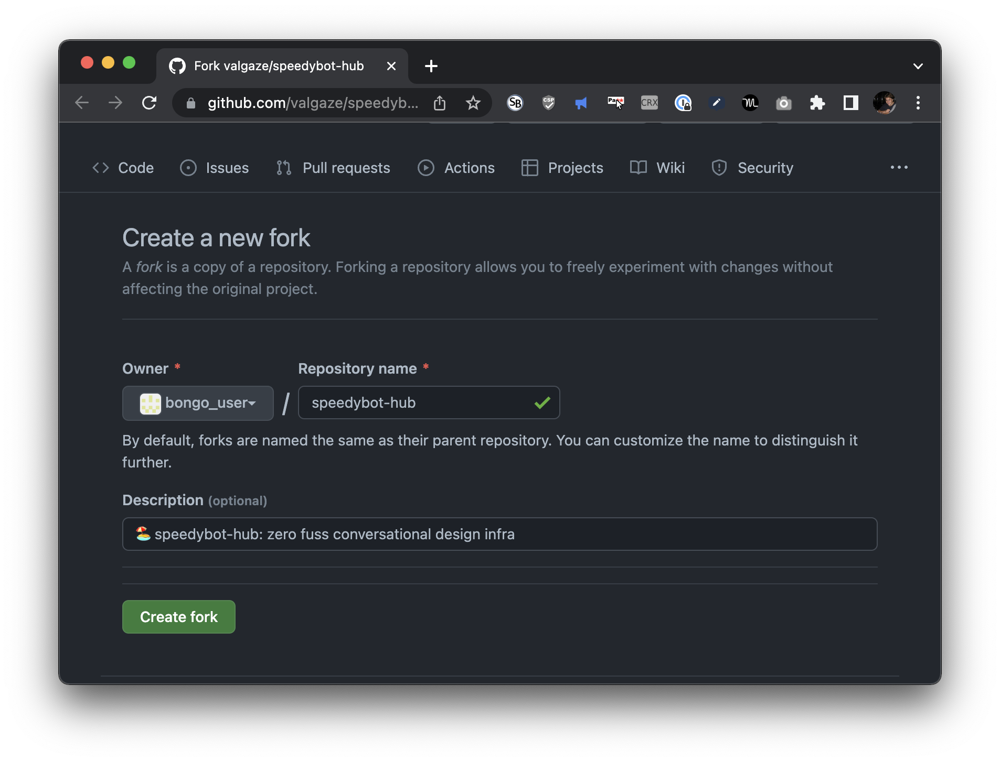
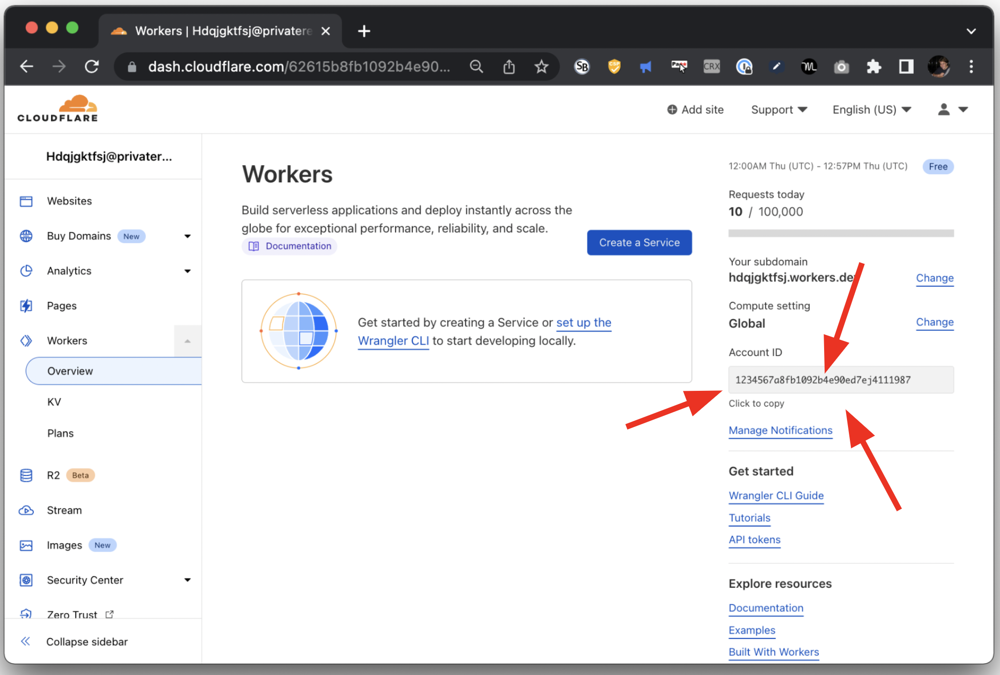
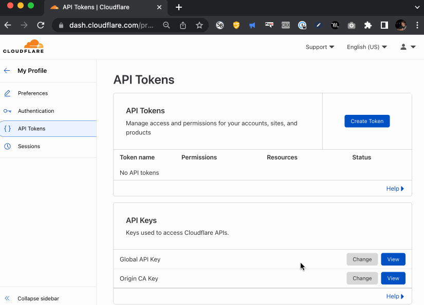
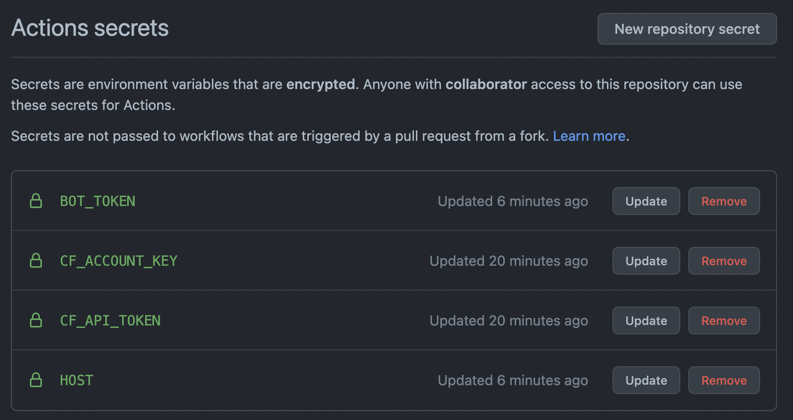

## 🍴 Fork'ing Guide

If you follow this guide you will end up with zero-config agent/repo where anytime you make a content change on the `deploy` branch, the agent will be automatically deployed using **[Github Actions](https://github.com/features/actions)** -- see the **["workflows" directory](./../.github/workflows/)** for details. The included actions handle deployment, webhook registration and **[secure secrets management](https://docs.github.com/en/actions/security-guides/encrypted-secrets)** for you so you can focus on what matters-- content + rich integrations.

## 0. Fork the repo

- Visit the repo and tap the **[Fork button in the top right corner](https://github.com/valgaze/speedybot-hub/fork)**



## 1. Get your bot token

- If you have an existing bot, get its token here: **[https://developer.webex.com/my-apps](https://developer.webex.com/my-apps)**

- If you don't have a bot, create one and save the token from here: **[https://developer.webex.com/my-apps/new/bot](https://developer.webex.com/my-apps/new/bot)**

- Write down your bot's access token, you'll need it in a minute

## 2. Get your bot URL

- If you don't have one already, get a **[cloudflare account](https://dash.cloudflare.com/sign-up)**

- Create a new "worker" from the **[cloudflare dashboard](https://dash.cloudflare.com)** (you want "HTTP Handler" when asked) and name it "speedybot-hub"

- Your URL should look roughly this: https://speedybot-hub.username.workers.dev

- **Note:** If you want to use a different name, make sure to update the **name** field in the root **[wrangler.toml fiile](./../wrangler.toml)**

## 3. Get your account Id

- From the main dashboard, tap "Workers" on the left sidebar and note your AccoundID from the right column



## 4. Get your API Key

- Visit here and select **Create Token** from the **[API Tokens page (https://dash.cloudflare.com/profile/api-tokens)](https://dash.cloudflare.com/profile/api-tokens)**

- Select the **Edit Cloudflare Workers** template and follow the prompts



## 5. Gather your secrets

By now you should have 4 pieces of information

```
BOT_TOKEN: xxxyyyzzz123
CF Account Id: xxxyyyzzz456
CF API Key: xxxyyyzzz789
Bot url: https://speedybot-hub.username.workers.dev
```

Go back to your forked repo and tap the settings button at https://github.com/_your_username_/speedybot-hub/settings/secrets/actions and add your secrets with exactly these names



## 6. Take it for a spin!

You can edit the **[settings/handlers.ts](../settings/handlers.ts)** file directly in github using their editor. Anytime you make a PR or change to the **deploy** branch the action will run, deploy your agent, register webhooks, etc using the secrets you specified above

Below is a long demonstration of making a change and following actions to completion:


