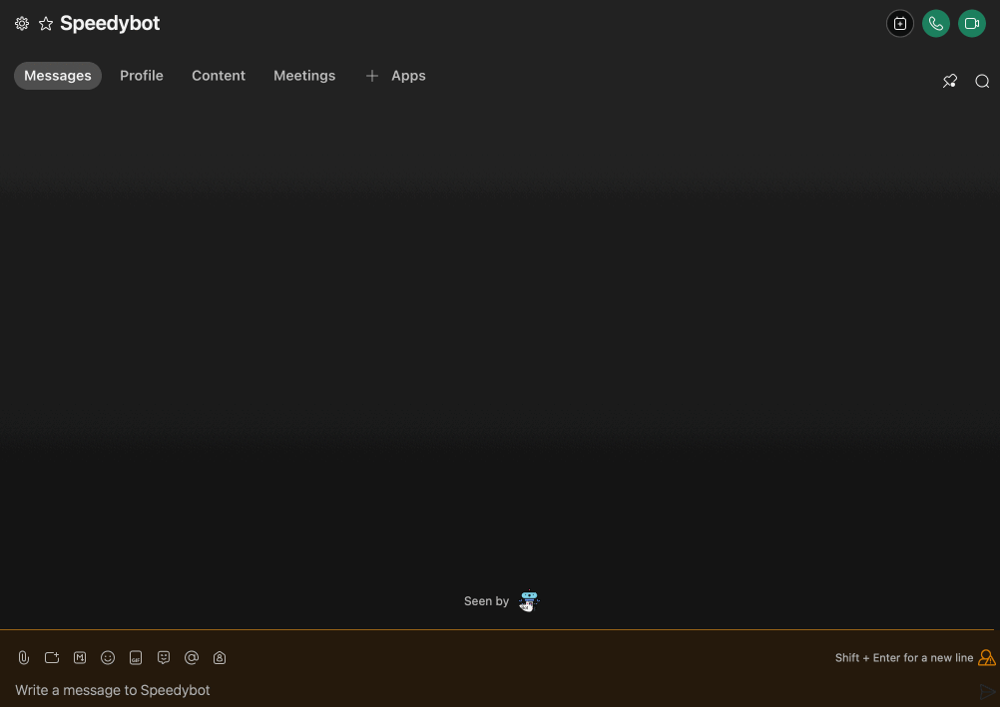
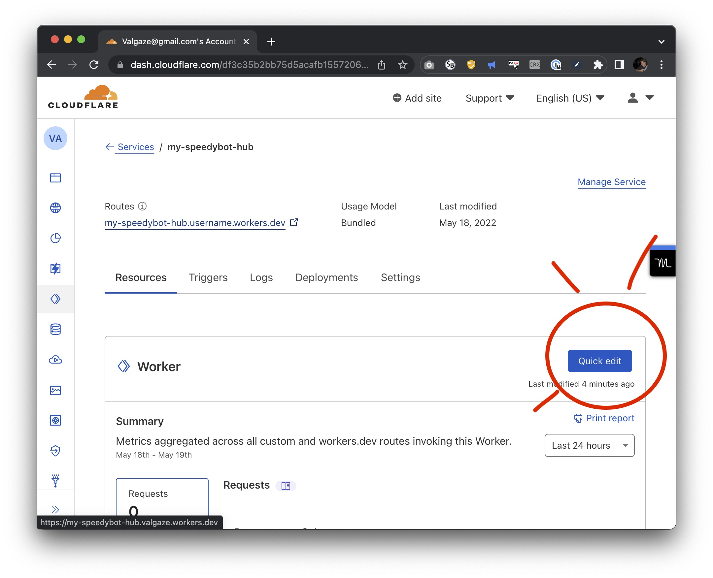

# [QUICKSTART] 🏖 `speedybot hubs` "cloud-native" conversation design infrastructure

Note: The steps below assume you have a working WebEx account & **[Nodejs](https://nodejs.org/en/download/)** 16.7+

**[Jump to "zero-effort" approach](#zero-effort)**

## Video instructions

- https://share.descript.com/view/em1B86UONQr

## 1. Fetch repo & install deps

```
git clone https://github.com/valgaze/speedybot-hub
cd speedybot-hub
npm i
```

## 2. Set your bot access token

- If you have an existing bot, get its token here: **[https://developer.webex.com/my-apps](https://developer.webex.com/my-apps)**

- If you don't have a bot, create one and save the token from here: **[https://developer.webex.com/my-apps/new/bot](https://developer.webex.com/my-apps/new/bot)**

- Write down your bot's access token, you'll need it in a minute

## 3. Get your bot URL

- If you don't have one already, get a **[cloudflare account](https://dash.cloudflare.com/sign-up)**

- Authenticate your machine with `npx wrangler login`

- Create a new "worker" from the **[cloudflare dashboard](https://dash.cloudflare.com)** & note its URL (you can name it something like https://speedybot-hub.username.workers.dev)

## 4. Register your webhooks

With your token + webhooks you can register your agent with the following command:

```sh
npm init speedybot webhook create -- -t __your__token__here -w https://speedybot-hub.username.workers.dev
```

Verify all is well with

```sh
npm init speedybot webhook list -- -t __your__token__here
```

## 5. Add your bot token "secret"

From the same directory as the repo run the following command to add a secret called `BOT_TOKEN` and enter your info

```sh
npx wrangler secret put BOT_TOKEN
```


## 5. Deploy your agent!

From the same directory as the repo run this command to deploy your agent (now bound with your `BOT_TOKEN` secret)

```
npm run deploy
```

## 6. Take it for a spin



## 6a Image detector

If you sign-up & setup credentials to Google vision (instructions here: **https://cloud.google.com/vision/docs/setup**) you can get easy image annotation with the built-in image-detector

**[$bot.imageDetector docs](https://github.com/valgaze/speedybot-hub/blob/deploy/api-docs/classes/BotRoot.md#imagedetector)**

## Zero Effort

If you don't want to muck around with the terminal, you have 2 other options

1. See **[🍴 Fork Guide](./docs/fork_guide.md)** to let **[Github Actions](https://docs.github.com/en/actions)** do virtually everything here for you

OR

2. Just copy 'n' paste it

Find your worker from the **[dashboard](https://dash.cloudflare.com/)** and select Quick Edit button and from there you can copy/paste the contents of speedybot-hub/index.js directly into the editor

Just add your bot token and tap Save and deploy



Note: If you copy/paste you'll still need to register your webhooks on Step 4 above
