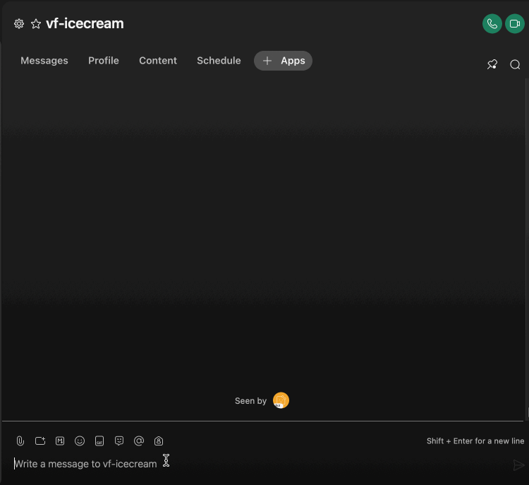

# [QUICKSTART] 🏖 `speedybot hubs` "cloud-native" conversation design infrastructure

Note: The steps below assume you have a working WebEx account & **[Nodejs](https://nodejs.org/en/download/)** 16.7+

## 1. Fetch repo & see index.js

```
git clone https://github.com/valgaze/speedybot-hub
cd speedybot-hub
open index.js
```

Or in a single command

```sh
npx speedybot-hub setup
```

## 2. Set your bot access token

- If you have an existing bot, get its token here: **[https://developer.webex.com/my-apps](https://developer.webex.com/my-apps)**

- If you don't have a bot, create one and save the token from here: **[https://developer.webex.com/my-apps/new/bot](https://developer.webex.com/my-apps/new/bot)**

Once you have the bot's token, save it to **[speedybot-hub/index.js](./index.js)** under the `token` field at the top of the file

## 3. Get your bot URL

- If you don't have one already, get a **[cloudflare account](https://dash.cloudflare.com/sign-up)**

- Authenticate your machine with `npx wrangler login`

- Create a new "worker" from the **[cloudflare dashboard](https://dash.cloudflare.com)** & note its URL (you can name it something like https://speedybot-hub.username.workers.dev)

## 4. Register your webhooks

With your token + webhooks you can register your agent with the following command:

```sh
npm init speedybot webhook create -t __your__token__here -w https://speedybot-hub.username.workers.dev
```

Verify all is well with

```sh
npm init speedybot webhook list -t __your__token__here
```

## 5. Deploy your agent!

You can use the repo and deploy with `npm run deploy` or alternatively, log in to the **[cloudflare dashboard](https://dash.cloudflare.com)**, find your worker, and select **Quick Edit** button and from there you can copy/paste the contents of **[speedybot-hub/index.js](./index.js)** directly into the editor and tap **Save and deploy**


## 6. Take it for a spin




